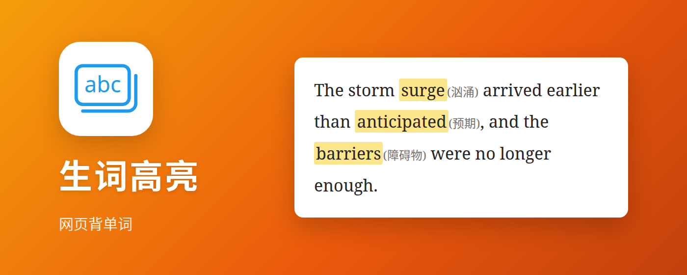
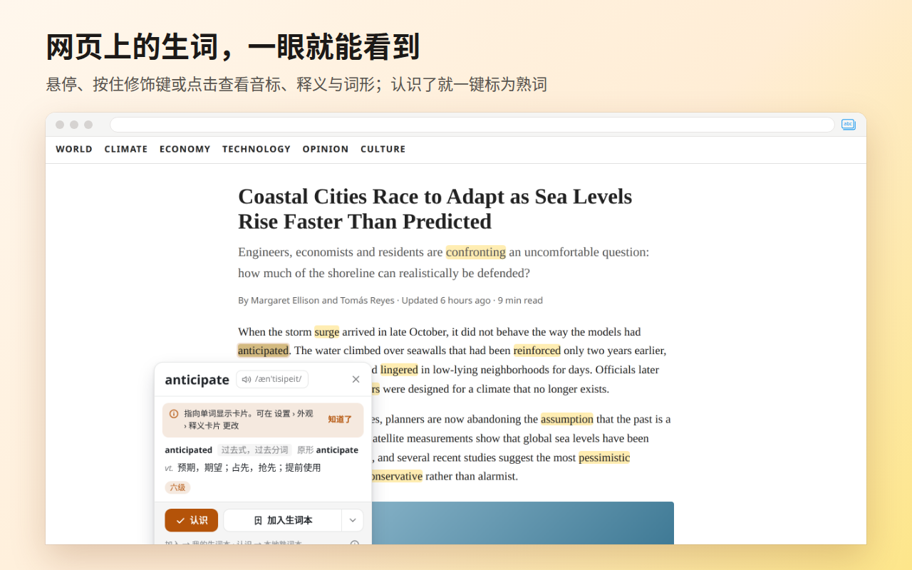
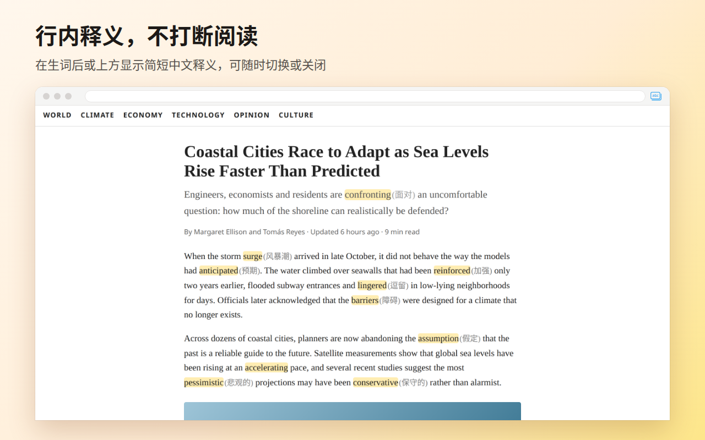
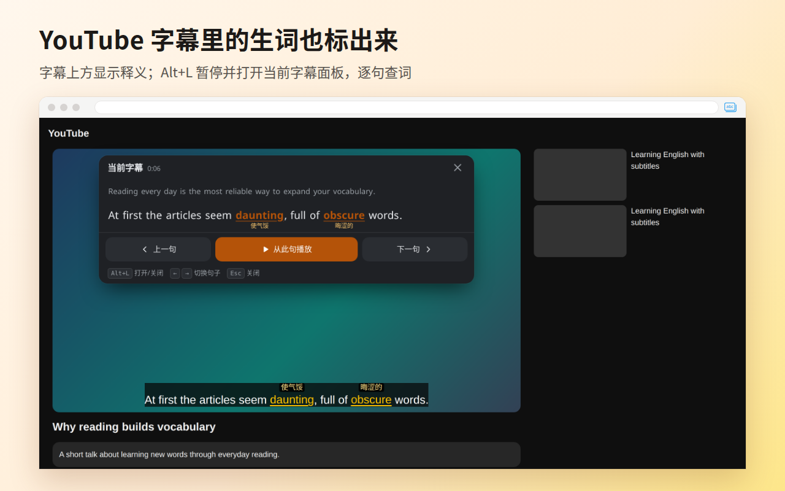
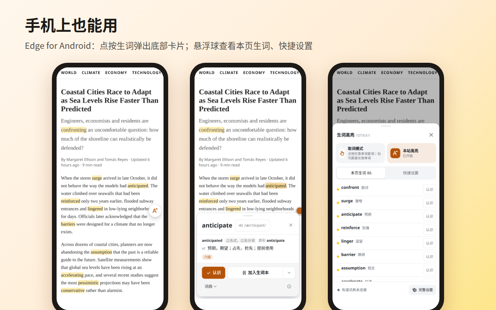
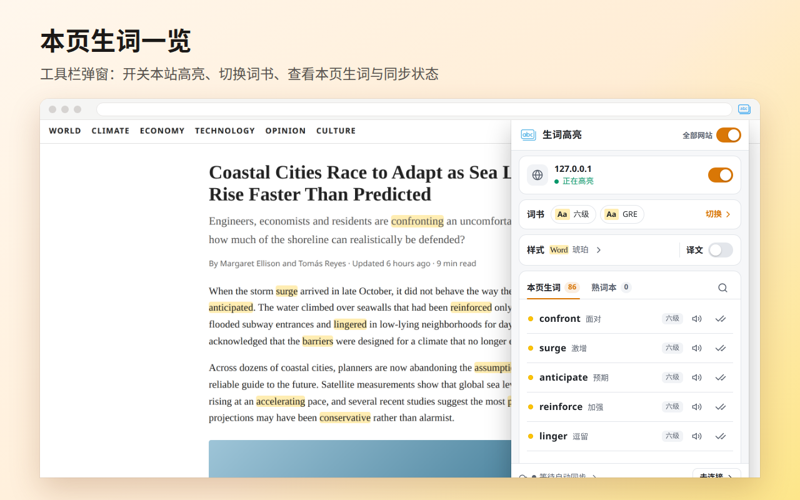
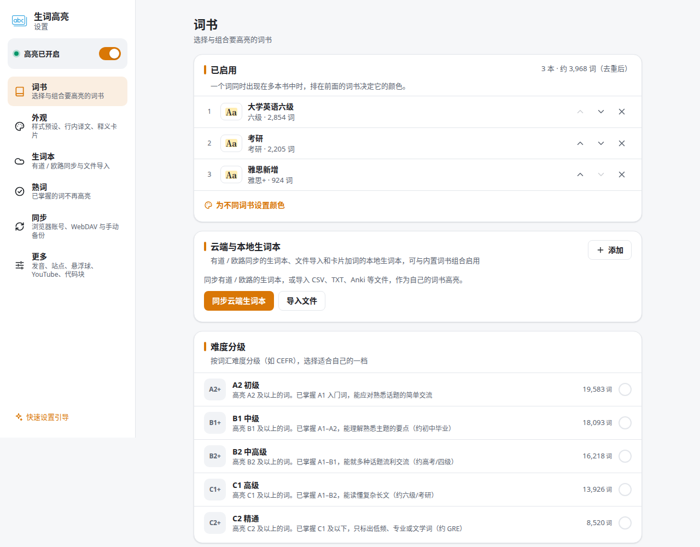
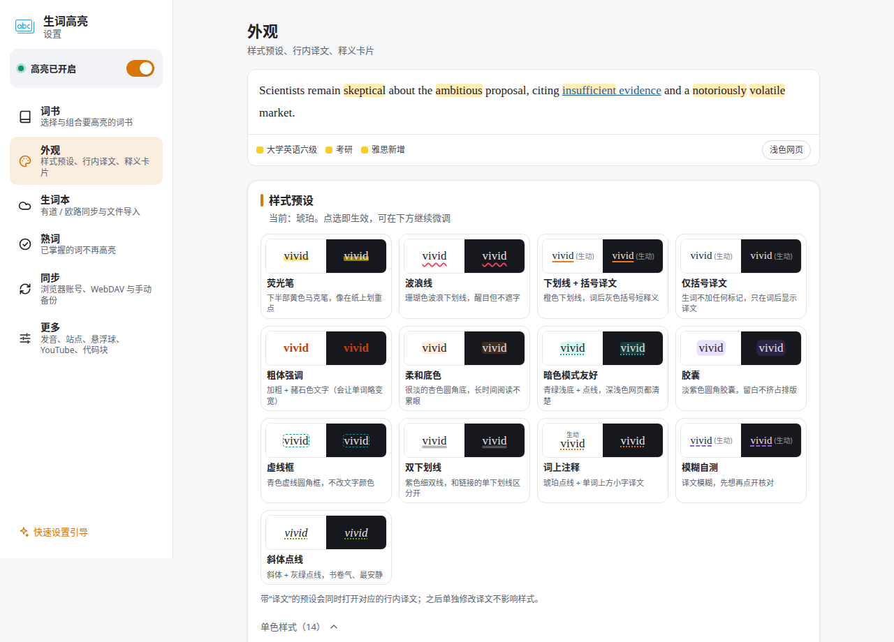

# 生词高亮：网页背单词

[TOC]

“生词高亮：网页背单词 · 有道/欧路生词本 · 四六级考研词书”（英文名 Highlight New Words – Vocabulary Builder for Youdao, Eudic, CET & IELTS）是一个浏览器扩展，适用于 Chrome、Edge（含 Edge for Android）。读英文网页或看 YouTube 视频时，它会把你要学的单词标出来。单词可以来自有道、欧路的云端生词本，也可以来自内置的四六级、考研、雅思、托福、GRE 等分级词书。悬停在单词上（手机上点按）就能看到音标、释义和词形；认识的单词标为熟词后，以后不再高亮。



## 一、功能介绍

### 1.1 选择要学的单词

- **内置分级词书**：中考、高考、四级、六级、考研、专四、专八、雅思、托福、SAT、GRE，CEFR A2–C2 难度分级，以及 COCA 词频分级。多本可以同时启用，每本可以单独设置样式。
- **云端生词本**：同步有道词典和欧路词典的生词本。同一来源下的每个生词本（如欧路的各个分类）都是一本独立词书，分别同步，互不影响。欧路的“已掌握单词”可以作为熟词本同步下来。
- **导入自己的单词表**：支持 TXT、CSV、TSV、有道导出 XML、欧路导出、Anki 导出文本。导入后是一本独立的本地词书，可以重命名、删除或重新导入覆盖。
- **词形还原**：running、ran 都按 run 判断。一个词标为熟词后，它的各种词形都不再高亮。

### 1.2 阅读时查词



- **释义卡片**：显示音标、发音、完整释义、考试标签，以及“过去式 / 原形 run”这样的词形说明。
- **卡片打开方式**：电脑上可以选鼠标悬停（延迟可调）、按住修饰键再悬停或点击，手机和触屏设备上点按单词。
- **行内释义**：在生词后面或上方显示简短中文释义，可以随时切换或关闭。可以开启“模糊翻译”自测，点按后才显示释义。



### 1.3 高亮样式


- 内置荧光笔、波浪线、下划线 + 括号译文、仅括号译文、粗体强调、柔和底色、暗色模式友好等十多套预设。选中预设后可以继续调整，并另存为自定义样式。
- 装饰线、文字、背景、边框和行内译文可以自由组合。设置页有实时预览，可以切换浅色和深色网页查看效果。
- 代码块标注默认关闭。开启后会标注技术文章中代码注释和字符串里的生词。在线编辑器和输入框不受影响，复制代码时也不会带出标注文字。

### 1.4 YouTube 字幕



- 字幕中的生词同样会高亮，默认在单词上方显示简短释义，也可以改为显示在词后或关闭。
- 按 `Alt+L` 会暂停视频并打开“当前字幕”面板。面板中整句放大显示，可以逐词查释义，也可以切换上一句、下一句。
- 可选开启“悬停字幕时自动暂停”，默认关闭。

### 1.5 手机与触屏



- 触屏设备上，卡片显示在屏幕底部。
- 屏幕边缘有一个悬浮球，提供本页生词列表、取词模式（点按任意单词查词）、快捷设置和同步状态；在 YouTube 视频页点悬浮球可以直接打开当前字幕面板。悬浮球可以拖动、吸附到屏幕边缘，也可以按网站关闭。电脑上不显示悬浮球。

### 1.6 工具栏弹窗、熟词与同步



- **工具栏弹窗**：开关本站高亮、切换词书和样式、查看本页生词与同步状态；工具栏图标上显示本页生词数。
- **加入生词本 / 标记熟词**：在卡片上可以把单词加入本地生词本或有道、欧路的云端生词本。标记熟词时，可以设置写入哪些熟词本、从哪些生词本中移除（默认只记在本地熟词本），10 分钟内可以撤销。熟词本支持导入导出。
- **跨设备同步**：设置、熟词本和导入的词书支持三种同步或备份方式，可以同时启用：
  - 浏览器账号同步（`storage.sync`）；
  - WebDAV（坚果云、Nextcloud、群晖等）；
  - 手动导出备份文件，导入时可选合并或覆盖。

  欧路 token、WebDAV 密码等凭据默认不随同步上传，需要逐项勾选后才会上传。

## 二、安装

### 2.1 从商店安装

扩展正在提交 Chrome 网上应用店和 Microsoft Edge 加载项，上架后这里会补上链接。Edge for Android 可以从 Edge 加载项安装。

### 2.2 从源码安装

需要 Node.js 和 npm（当前开发环境为 Node.js 24）。

```bash
npm ci
npm run build          # 产物在 .output/chrome-mv3
```

在 Chrome 中打开 `chrome://extensions`（Edge 中打开 `edge://extensions`），开启“开发者模式”，点“加载已解压的扩展程序”，然后选择 `.output/chrome-mv3` 目录。

Firefox 只用于开发调试，暂不上架，加载方法见 [docs/release.md](./docs/release.md) 的“Firefox 开发调试”一节。Firefox 默认不授予“访问所有网站”权限，需要按扩展弹窗中的提示授权，否则不会高亮。

## 三、使用

安装后会自动打开首次引导页，三步选好词书、高亮样式和生词本；之后都可以在扩展设置页修改（点工具栏图标，再点弹窗中的设置入口）。


首次引导的第一步，勾选要学习的词书，可以多选组合。

1. **选择词书**：打开设置页的“词书”，启用要学习的分级词书，可以多选。

   

   “已启用”列出当前生效的词书，排在前面的词书决定重叠单词的颜色，可以调整顺序或移除。

2. **连接生词本（可选）**：在“生词本”中设置来源。
   - **有道**：在浏览器中登录有道词典网页版后，扩展会自动读取生词本。云端来源默认都不开启；在设置中打开后会立即连接并同步一次，之后最多每天自动同步一次，也可以手动同步。
   - **欧路**：推荐填写 OpenAPI token。登录 my.eudic.net 后打开 [OpenAPI 授权页](https://my.eudic.net/OpenAPI/Authorization)，复制以 `NIS` 开头的整串授权信息，粘贴到设置页并刷新分组列表即可。使用 token 时可以按分类同步和写入；不填 token 时，仍按旧版方式通过网页登录状态拉取“全部生词”。
   - 也可以在这里导入本地单词表。

   

   打开欧路词典的开关后，在“OpenAPI 授权 token”一栏粘贴 token；有道只需要打开开关并保持网页版登录。

3. **阅读**：刷新网页后，生词会被高亮。悬停或点按单词查看卡片，认识的单词点“认识”标为熟词。
4. **调整外观**：在“外观”中选择预设、开关行内译文、设置卡片打开方式；在“更多”中设置发音、按网站开关、悬浮球、YouTube 和代码块标注。

   

   顶部的预览会随选中的预设实时变化，点任一预设即可生效，也可以在下方继续微调。

5. **同步（可选）**：在“同步”中启用浏览器账号同步、WebDAV 或手动备份。

   

   浏览器账号同步可以分项开关并显示空间占用；WebDAV 提供坚果云、Nextcloud、群晖的预设地址。

从旧版（v2）升级时，设置和生词本会自动迁移。

## 四、隐私

- 网页文字只在本地和词书比对，不会上传。扩展没有开发者自己的服务器，不做统计、不接入广告。
- 只有在你启用对应功能后，浏览器才会直接请求有道、欧路、你填写的 WebDAV 服务器，或浏览器厂商的同步服务。安装后默认不连接任何云端生词本来源；你打开有道或欧路来源后才会发起请求，之后每天同步一次。有道只依靠浏览器里已有的有道登录状态读取生词本。
- 内置词书和词典都随扩展打包，不加载远程代码。

完整说明见 [隐私政策](./store/privacy-policy.md)，每个权限的用途见 [权限说明](./store/permissions.md)。

## 五、开发

基于 WXT + TypeScript + Vue 3（MV3）。架构、目录分工和模块契约见 [docs/architecture.md](./docs/architecture.md)。

| 命令 | 说明 |
| --- | --- |
| `npm install` | 安装依赖（会自动执行 `wxt prepare`） |
| `npm run dev` / `npm run dev:edge` | 开发模式 |
| `npm run build` | 生产构建，产物在 `${OUT_DIR:-.output}/chrome-mv3` |
| `npm run build:edge` / `npm run build:firefox` | Edge（与 chrome 产物相同）/ Firefox 构建 |
| `npm run typecheck` | `vue-tsc` 类型检查 |
| `npm test` / `npm run test:watch` | Vitest 单测 |
| `npm run zip` / `npm run zip:edge` / `npm run zip:stores` | 打包上传商店用的 zip |
| `npm run qa:shot -- --ext <产物目录> ...` | 用 Playwright 批量截图做视觉 QA，参数见 [scripts/qa/shot.mjs](./scripts/qa/shot.mjs) |

多个构建并行时，用 `OUT_DIR` 隔离输出目录，例如 `OUT_DIR=/tmp/out/foo npm run build`。内置词书和词典数据由 [scripts/data](./scripts/data) 生成，步骤见架构文档的“命令与 OUT_DIR 约定”一节。

## 六、目录入口

| 路径 | 内容 |
| --- | --- |
| [docs/architecture.md](./docs/architecture.md) | 架构说明：技术栈、目录归属、核心契约、命令、已知缺口 |
| [docs/release.md](./docs/release.md) | 发布与上架：构建打包、版本号策略、Chrome / Edge 发布流程、发版检查清单 |
| [src/](./src) | 源码：`background` 后台、`content` 内容脚本（高亮引擎、卡片、悬浮球、站点适配）、`entrypoints` 弹窗与设置页、`core` 共享契约 |
| [public/data](./public/data) | 内置词书、词典与词形数据 |
| [store/](./store) | 商店文案、截图、隐私政策、权限说明 |
| [scripts/](./scripts) | 数据生成、视觉 QA、兼容性测试脚本 |
| [tests/](./tests) | 单测与测试页面 |

## 七、数据来源与许可

内置词书与词典数据来自以下项目，按各自许可使用：

- [ECDICT](https://github.com/skywind3000/ECDICT)（MIT）
- [CEFR-J Wordlist 1.5](http://www.cefr-j.org/download.html)
- [KyleBing/english-vocabulary](https://github.com/KyleBing/english-vocabulary)（BSD-3-Clause，仅使用单词列表）

完整的署名与许可声明见 [public/data/NOTICE.txt](./public/data/NOTICE.txt)。

## 八、许可证

[Apache License 2.0](./LICENSE)
