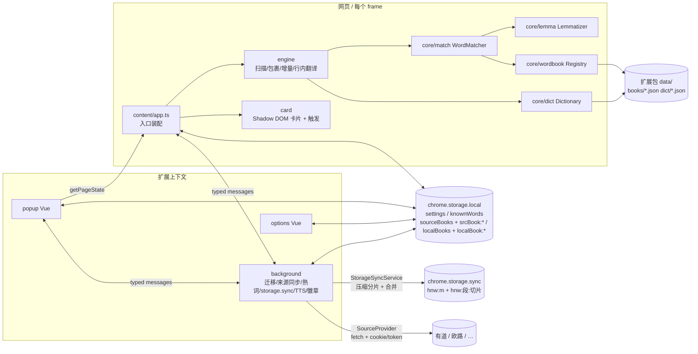
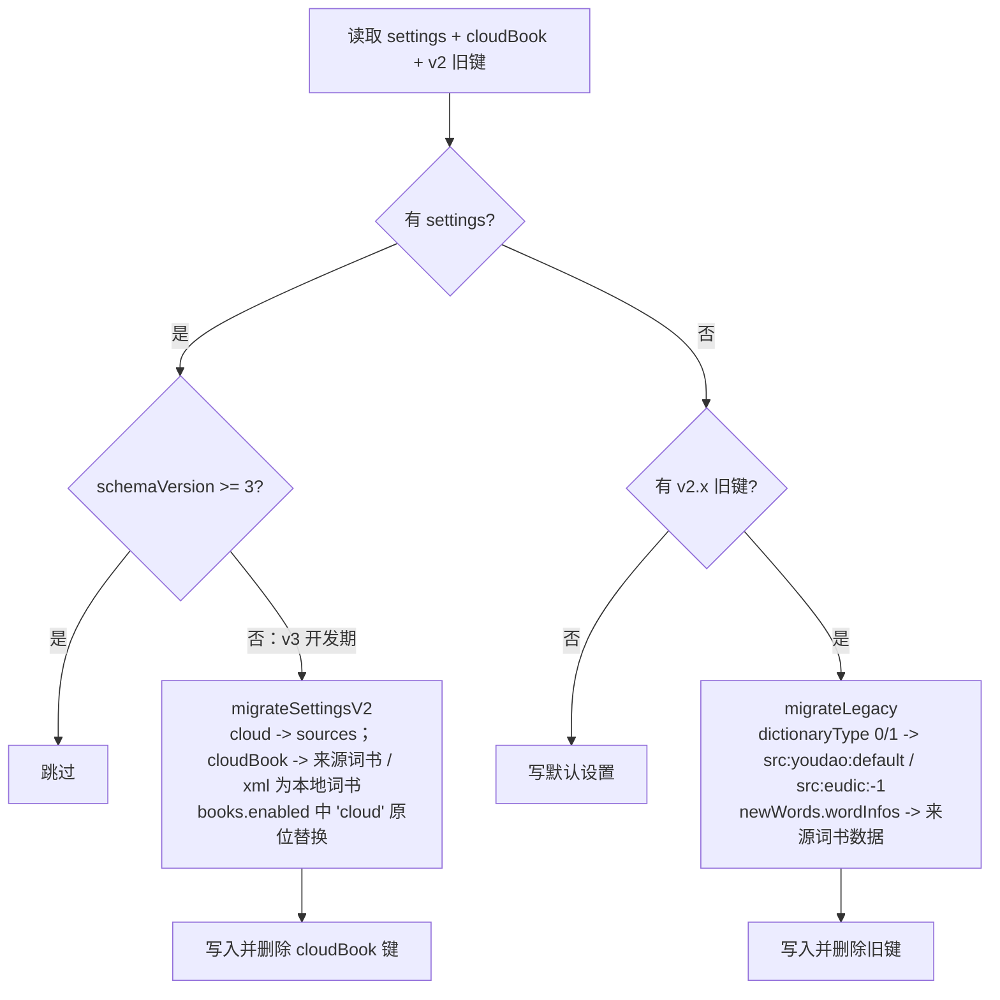
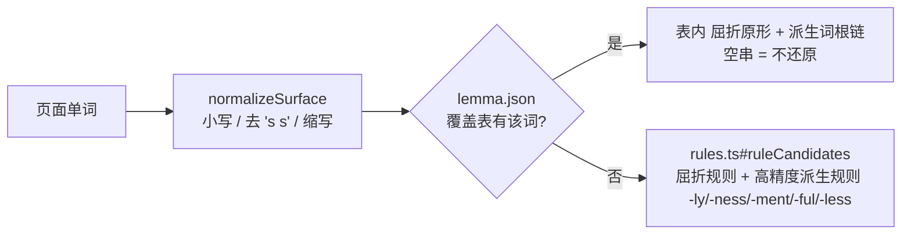
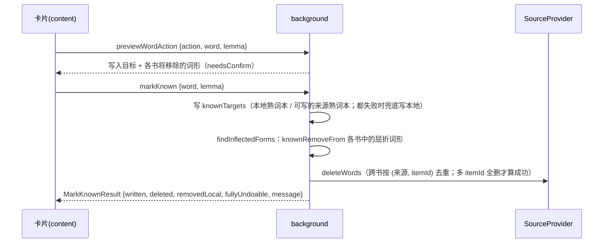
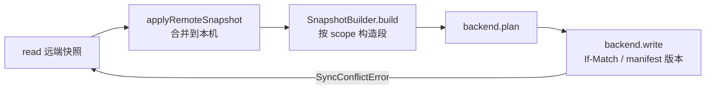
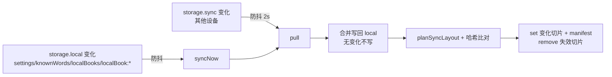
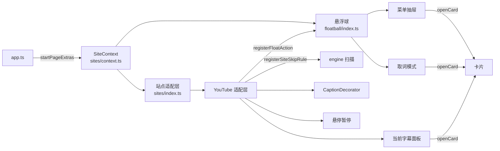

# 生词高亮扩展 v3 架构说明

[TOC]

## 一、技术栈

| 层 | 选型 | 说明 |
| --- | --- | --- |
| 扩展框架 | [WXT](https://wxt.dev) 0.21 | MV3；`srcDir=src`；关闭自动导入（`imports: false`），所有依赖显式 import |
| 语言 | TypeScript 5.9（strict + `noUncheckedIndexedAccess`） | `vue-tsc --noEmit` 做类型检查 |
| popup / options | Vue 3（`<script setup>`） | 样式方案：**纯 CSS 变量 + 组件 scoped CSS**，不引入 UI 框架/Tailwind；设计令牌在 [src/ui/tokens.css](../src/ui/tokens.css)，自动适配深浅色、触屏下点击区 ≥ 44px |
| 内容脚本 | 原生 DOM，无框架 | 页面内高亮用自定义标签 `hnw-mark`/`hnw-tr` + 注入 `<style>`；释义卡片在 Shadow DOM（`hnw-card-host`）中 |
| 单测 | Vitest + jsdom + WXT fake-browser | `tests/unit/**/*.test.ts` |
| 视觉 QA | Playwright 1.63（devDependency） | [scripts/qa/shot.mjs](../scripts/qa/shot.mjs) |
| 数据 | ECDICT（MIT）+ CEFR-J 1.5（署名免费商用）+ KyleBing 词表（BSD-3，仅词表） | [scripts/data/fetch-raw.sh](../scripts/data/fetch-raw.sh) 下载固定版本原始数据，[scripts/data/build-data.mjs](../scripts/data/build-data.mjs) 确定性生成 `public/data`（来源声明见 `public/data/NOTICE.txt`） |

目标浏览器：Chrome 与 Edge（含 Edge for Android），Edge 直接使用 chrome 构建产物（`npm run build:edge` 仅改输出目录名）。

## 二、整体结构



设计原则：

- **设置类变更不走消息**：任何上下文直接写 storage，其他上下文用 `storage.onChanged` 感知（内容脚本见 `startContentApp`，Vue 见 `useSettings`/`useBooks`）。本地导入词书、熟词本文本编辑同样由扩展页面直接写。
- **需要网络或跨数据协调的操作走 background 消息**：来源同步/删词、标记熟词与加入生词本（含来源词书的写入与删除）、storage.sync 状态。
- **匹配在内容脚本本地完成**：词书/词典按需从扩展包 fetch（`web_accessible_resources: data/*`），不逐词发消息。
- **大数据与设置分离**：`settings` 只放小对象；用户词书按“索引键 + 每本一个数据键”拆分，熟词本单独成键。
- **读改写加锁**：同一扩展源（background/扩展页面）的 storage 读改写走 `withStorageLock`（Web Locks API），内容脚本不做读改写。

## 三、目录与分片归属

后续并行开发按分片划分目录，**只改自己拥有的目录**；需要改动他人契约（下表“共享契约”）时，先在进度中说明并保持向后兼容。

| 分片 | 拥有的目录/文件 | 依赖的契约 |
| --- | --- | --- |
| data | `public/data/**`、`scripts/data/**`、`src/core/wordbook/registry.ts`（加载实现）、`src/core/dict/packaged.ts` | `BookCatalog`/`BookDataFile`/`DictShardFile`、`WordBookRegistry`、`Dictionary` |
| lemma | `src/core/lemma/**`、`public/data/lemma/**`（`lemma.json`）、`scripts/lemma/**`（数据生成）、`tests/fixtures/lemma-gold.tsv`（金标集） | `Lemmatizer` |
| engine | `src/content/engine/**`、`src/content/app.ts` | `WordMatcher`、`Dictionary`、`dom.ts` 常量 |
| card | `src/content/card/**`、`tests/unit/card*.test.ts` | `CardView`/`CardData`/`CardActions`、`CardStyle`；对外提供 `bindCardTrigger`/`registerCardTriggerZone`/trigger-config 纯函数（见 4.5“卡片触发方式”） |
| options | `src/entrypoints/options/**`（含导入 UI `LocalBooksSection`、熟词管理 UI `KnownSection`、来源 `SourcesSection`、同步 `SyncSection`）、`src/ui/components/**`（与 popup 共享，新增组件为主）、`src/core/import/parse.ts`（解析实现） | `Settings`、`useSettings`、`useBooks`、`BUILTIN_THEMES`、`ImportFormat`/`parseWordList`、user-store、known store、`SyncStatus` |
| popup | `src/entrypoints/popup/**` | 同上 + `getTabWords`/`getPageState`/`syncSourceBooks`/`getStatusSummary`/`syncAll` 消息（“全部同步”发 `syncAll({background:true})` 后按约 1.5 秒轮询 `getStatusSummary().syncAll`，见 `syncAllRunner.ts`；总状态不可用时用本地 `syncState`/`webdavSyncState`/来源索引兜底）、platform `hasAllSitesAccess`/`requestAllSitesAccess`、预设切换复用 options 的 `applyPreset`/`presetGroups`（`options/lib/appearance.ts`，改签名需同步 popup）；发音用 `tts` 消息，后台返回 `reason='unavailable'` 时 popup 再用 platform `speakText` 在扩展页朗读；收藏用 `getWordState`/`addWord`/`removeWord` |
| background | `src/background/**`（含来源 provider `src/background/sources/**`、熟词流程 `known.ts`）、`src/entrypoints/background.ts`、`src/core/sync/**`（storage.sync 同步层） | `BackgroundProtocol`、`SourceProvider`、settings/known/user-store |
| floatball | `src/content/floatball/**`（通用悬浮球、取词模式）、`src/content/sites/**`（站点适配层与 `SiteContext` 实现，含 YouTube）、`tests/fixtures/youtube*`、`tests/fixtures/floatball*` | `SiteContext`、`CardView`、`registerSiteSkipRule`、popup `model.ts` 与 options `lib/appearance.ts` 的纯函数、`getStatusSummary`/`syncAll`/`markKnown`/`unmarkKnown` 消息；见 4.12 |

**共享契约（改动需协调）**：`src/core/settings/**`、`src/core/messaging/**`、`src/core/storage/**`、`src/core/theme/**`、`src/core/match/**`、`src/core/source/**`、`src/core/known/**`、`src/core/wordbook/{ids,types,user-store,user-book,registry}.ts`（registry 加载实现仍归 data 分片完善）、`src/core/import/types.ts`、`src/core/sync/types.ts`、各模块 `types.ts`、`src/ui/composables/**`、`src/ui/tokens.css`、`wxt.config.ts`、`package.json`。

测试放 `tests/unit/<分片>*.test.ts`，fixture 页面放 `tests/fixtures/`（新增文件即可，不要改他人 fixture 的已有内容）。

## 四、核心契约

### 4.1 设置（Settings）

定义见 [schema.ts](../src/core/settings/schema.ts)，默认值见 `createDefaultSettings`，读写见 [store.ts](../src/core/settings/store.ts)。

| 字段 | 含义 |
| --- | --- |
| `updatedAt` | 最近修改时间，`saveSettings` 自动刷新（只改本机字段 `sync`/`apiToken` 时不刷新，避免新设备刚配好同步就用默认设置覆盖远端）；各同步后端按此 LWW |
| `enabled` | 总开关（旧 `toggle`） |
| `books.enabled` | 启用词书 id 数组，三类词书可任意组合；顺序即优先级（id 规则见 4.2） |
| `style.themeId` / `style.custom` / `style.perBook` / `style.saved?` | 全局主题、自定义颜色（含旧版 4 个颜色）、按词书覆盖；`saved` 为用户另存的样式库（`SavedMarkStyle[]`，options 第二阶段新增，可选，渲染不读取） |
| `inlineTranslation` | `mode`：`off` / `after`（词后）/ `ruby`（词上方，CSS `display:ruby`）/ `hover`（仅悬停浮现，不占位；engine 第二阶段新增）；译文样式（`TranslationStyle`，全部可选）：`blur` 模糊自测、`color`、`opacity`（0.2–1）、`fontScale`（0.5–1）、`bracket`（括号，各显示位置通用；缺省时词后显示为半角、词上/词下小字不加，解析为 `bracket`/`rubyBracket`：`paren` 半角 / `fullwidth` 全角 / `square` 方括号 / `lenticular` 方头括号【】/ `none` 不加）、`background`（译文底色，空串=无）、`italic`、`bold`，缺省值见 `TRANSLATION_STYLE_DEFAULTS`，解析用 `resolveTranslationStyle`；字段缺省时渲染与没有这些字段时一致，旧设置无需迁移。译文样式预设见 4.7 |
| `code` | 代码块中标注生词（v8，engine 新增）：`enabled`（默认 false）、`scope` `comments`（默认，只处理语法高亮标出的注释和字符串）/ `all`、`display` `hover`（默认，代码中不显示译文）/ `float`（单词上方浮动小标注，不占位） |
| `card.trigger` / `card.modifier` / `card.hoverDelay` | PC 端（鼠标）卡片触发方式（触屏/手机端点按打开，不受影响；触屏点按可由 `card.tapOpen` 关闭，关闭后页面生词的点按交给页面，字幕面板等注册区域与悬浮球取词不受影响；触屏长按选词查词由 `card.longPressOpen` 控制，与悬浮球是否显示无关）：`auto`（旧默认值）/`hover` 悬停；`modifier` 按住修饰键 + 悬停（v11 card 新增，旧版本收到时按悬停处理）；`click` 点击（链接中的单词第一次点击弹卡，再点一次或带修饰键点击才跳转）。`modifier` 为 `alt`（默认）/`ctrl`/`shift`/`meta`（⌘，只在 macOS 提供，其他系统按 Ctrl 处理）。`hoverDelay` 为悬停弹卡延迟（ms）：`100` 灵敏 / `250` 标准（默认）/ `400` 稳妥，档位见 `CARD_HOVER_DELAYS`；悬停与“修饰键 + 悬停”移入单词时生效，指针已在单词上再按修饰键的 180ms 不受影响（card 修复轮新增，旧设置由 `normalizeSettings` 补齐，非法值按 250）。解析与文案用 [trigger-config.ts](../src/content/card/trigger-config.ts) 的纯函数，见 4.5“卡片触发方式” |
| `tts` | 自动发音开关、`voice`（`chrome.tts.speak` 选项）、语速 |
| `sources[providerId]` | 按来源配置 `SourceSettings`：`enabled`（默认全部 false）、`autoSync`（每天）、`deleteOnKnown`（默认 false，`wordActions.knownRemoveFrom='auto'` 时生效）、可选 `apiToken`（本机字段；只有勾选 `credentialSync["token:<id>"]` 时才作为凭据随同步上传） |
| `knownBooks` | 熟词本多来源：`enabled` 启用的来源熟词本 id（角色为 known 的来源词书，如欧路“已掌握单词”，首次同步成功自动加入）；`roles` 用户为来源词书指定的角色 `new`/`known`（覆盖 provider 声明）。本地熟词本始终生效，见 4.9 |
| `wordActions` | 单词操作目标（见 4.9）：`sameLemma` 同原形开关（默认开）；`addTargets` 加入生词本写入的书（默认 `local:mine` “我的生词本”）；`addRemoveFromKnown` 加入时移出的熟词本（默认本地熟词本 `known:local`）；`knownTargets` 认识时写入的熟词本（默认 `known:local`）；`knownRemoveFrom` 认识时移除的生词本，`'auto'` = 沿用各来源 `deleteOnKnown` |
| `sync` | 本机同步配置（不参与同步）：`enabled`/`include` 为 chrome.storage.sync 后端；`webdav` 为 WebDAV 后端（`enabled/url/username/password/dir/include(+sourceBooks)/autoSync{onChange,onStartup,intervalMinutes}`），见 4.11 |
| `credentialSync` | 凭据是否随同步上传：`token:<providerId>`（来源 API token）、`webdav`（WebDAV 连接信息含密码），默认全部 false；本字段参与设置同步，各设备一致，见 4.11 |
| `sites.disabled` | 禁用站点（含子域名，见 `isSiteDisabled`） |
| `ui.theme` | 扩展页面（popup/options）界面主题 `auto`/`light`/`dark`（options 分片新增，默认 `auto`）；页面在根元素设置 `data-theme`，`auto` 时不设置、跟随系统 |
| `youtube` | YouTube 字幕（v9，floatball 负责）：`captions` 字幕中标注生词（默认开）；`captionTranslation` 字幕内生词译文 `above` 上方注解（默认）/ `below` 下方注解 / `after` 词后小字 / `off` 只高亮（自动生成字幕的 `above`/`below` 改用 `after`）；`captionStyle`（可选）字幕注解样式：`color`（空串=跟随字幕文字颜色，缺省暖黄）、`background`（空串=无底色，改用加重黑色描边）、`fontScale`（相对字幕字号 0.55–1，缺省 0.64）、`bracket`（缺省不加，三种模式都适用）、`bold`、`italic`，类型、缺省值、7 套预设 `CAPTION_GLOSS_PRESETS` 与 `resolveCaptionStyle`/`applyCaptionPreset`/`matchCaptionPreset` 在 [caption-style.ts](../src/core/theme/caption-style.ts)；`hoverPause` 桌面悬停字幕自动暂停（默认关）。见 4.12 |
| `floatBall` | 通用悬浮球（v10，floatball 新增）：`enabled` 全局开关（默认开）、`hiddenSites` 隐藏悬浮球的站点（规则同 `sites.disabled`）。只在触屏/手机端显示 |
| `performance.prehide` | 加载时先隐藏页面，避免首屏译文插入造成跳动（engine 第 3 轮新增，默认 `false`，旧设置由 `normalizeSettings` 补齐）。开启后由 background 动态注册隐藏样式，见 4.5“首屏预隐藏” |

**存储键**（[keys.ts](../src/core/storage/keys.ts)，`storage.local`）：

| 键 | 结构 | 写入方 |
| --- | --- | --- |
| `settings` | `Settings`（`SETTINGS_SCHEMA_VERSION = 3`） | 任意上下文 |
| `knownWords` | `KnownWordsData { words: 词→加入时间, removed: 词→撤销时间(墓碑) }` | background（markKnown）、options（编辑/导入）、sync |
| `sourceBooks` | `SourceBookIndex { books: id→SourceBookState, providers: id→{lastListAt, error} }` | background |
| `srcBook:<bookId>` | `SourceBookData { id, words: UserWordMap, updatedAt }` | background |
| `localBooks` | `LocalBookIndex { books: id→LocalBookMeta, removed: id→删除时间 }` | options、sync |
| `localBook:<bookId>` | `LocalBookData { id, words }` | options、sync |
| `syncState` | `SyncStatus`（storage.sync 用量/阶段/错误/设备 id） | background |
| `webdavSyncState` | `BackendSyncStatus`（WebDAV 阶段/错误/上次同步/设备 id/retryAt/recheckAt） | background |
| `webdavLock` | `WebDavHeldLock { url, token, at }`：本机持有的 WebDAV 写锁令牌，LOCK 成功时写入、UNLOCK 后删除；SW 持锁时被回收，重启后第一次写入先用它 UNLOCK（第 5 轮新增） | background |
| `syncCredStamps` | 凭据修改时间戳 `id → { at, h 值摘要 }`（凭据合并用） | background |
| `uiNotesSeen` | 选项页已读“更新说明”版本（字符串，见 options `lib/release-notes.ts`；全新安装记为已读不弹出） | options |
| `floatBallPos` | `FloatBallPos { side: 'left'\|'right', y: 视口高度比例 }`：悬浮球位置，按设备记忆，不参与同步 | 内容脚本（floatball） |
| `cardTriggerHint` | 已提示过的卡片触发方式签名（字符串，如 `hover`、`modifier:alt`、`click`）：PC 端卡片首次出现时提示一次当前触发方式，方式变化后再提示一次；提示可见满 1 秒或用户在卡片内按下后才写入；按设备记忆、不参与同步（card v11 新增） | 内容脚本（card） |
| `knownUndo` | 单词操作撤销记录 `known:<lemma>` / `add:<lemma>` → `{ at, sourceRemoved, localRemoved, knownLocalRemoved, sourceAdded }`：10 分钟内撤销有效；存 local 使浏览器重启后仍可撤销，过期记录只用于说明“撤销记录已失效”，24 小时后清理（集成审核第 1 轮由 `storage.session` 迁来） | background |
| `updateNotice` | `UpdateNotice { from, to, at }`：扩展从旧版本升级（`onInstalled reason=update`，版本号不同）时写入，options/popup 展示简短“更新说明”后发 `dismissUpdateNotice` 清除（第二阶段新增） | background |

`storage.session` 中 `tabWords` 用于徽章；`storage.sync` 键见 4.9。

**迁移**：background 启动时调用 `runMigrationIfNeeded`：



v2.0.1 旧键 `toggle/ttsToggle/ttsVoices/highlight*/bubble*/dictionaryType/autoSync/syncTime/newWords.wordInfos` 全部保留迁移；旧 `cookie` 仅为记录用途（请求由浏览器自动带 cookie），不再迁移。旧版用过云端生词本（`syncTime>0` 或有 `newWords.wordInfos`）时只启用对应来源和迁移出的来源词书（lastSyncAt 沿用 syncTime，每天自动同步照常）；从未用过的与新安装一致，不启用任何来源。改过颜色的切到 `custom` 主题。新增字段只需在默认值中补齐，`normalizeSettings` 会深合并；不兼容调整需递增 `SETTINGS_SCHEMA_VERSION` 并在 migrate.ts 追加步骤。

### 4.2 词书与词典

词书分三类，id 规则见 [ids.ts](../src/core/wordbook/ids.ts)（`parseBookId` / `sourceBookId` / `localBookId`）：

| 类别 `BookKind` | id | 数据 | 元数据 |
| --- | --- | --- | --- |
| `builtin` 内置分级 | catalog id，如 `cet6` | 扩展包 `data/books/<id>.json` | `CatalogBookMeta` |
| `source` 来源词书 | `src:<providerId>:<encodeURIComponent(remoteId)>` | `srcBook:<id>` | `SourceBookState`（同步状态） |
| `local` 本地导入 | `local:<uuid>` | `localBook:<id>` | `LocalBookMeta`（名称/格式/词数） |

- `WordBookRegistry`（[types.ts](../src/core/wordbook/types.ts)）：`list()` 返回三类统一的 `BookMeta[]`（用户词书在前，`kind`/`category='user'`/`providerId`/`sync`/`importFormat` 等元数据），`load(id)` 懒加载并缓存 `WordBook { has, size, words(), entry?(word) }`。用户词书由 `createUserWordBook` 包装，`entry` 返回自带的 `UserWord { word, phonetic, trans, ref }`（`ref` 为 provider 删除句柄）。实现 `DefaultWordBookRegistry` 通过 `RegistryLoaders` 注入数据源，`createExtensionLoaders()` 为运行时实现。
- 用户词书读写：[user-store.ts](../src/core/wordbook/user-store.ts)（`getSourceIndex`/`patchSourceBookState`/`saveSourceBook`、`saveLocalBook`（新建或覆盖导入）/`renameLocalBook`/`deleteLocalBook`（留墓碑））。
- 打包数据格式：
  - `data/books/index.json`：`BookCatalog { version: 2, books: CatalogBookMeta[] }`，已按 分类 → 难度 排序；增量书带 `delta { of, minus }`
  - `data/books/<id>.json`：`BookDataFile { id, words: string[], extends?: BookId[] }`（小写原形、已排序）。级别/词频书是包含关系，只存比 `extends` 多出的词，`DefaultWordBookRegistry` 加载时递归合并并缓存共享文件
  - 词典两层分片（首字母 `a-z`）：短表 `data/dict/<c>.json` = `{ word: { p 音标, s 行内短释义(单义项、无词性、≤8 字，约 97% 为 2–6 字), v 动词短释义(可选，见下), g 考试标签, l 级别 1–6, r 词频排名 } }`；全表 `data/dict/full/<c>.json` = `{ word: { f 完整释义(每行一个词性), x 词形 "s:widths/p:…" } }`。旧格式（f 在短表）仍兼容
- `Dictionary`（[dict/types.ts](../src/core/dict/types.ts)）：`DictEntry { word, phonetic, short, shortVerb?, full, tags, level?, rank?, forms? }`。**`lookupMany` 只读短表**（整页行内翻译，不含 full/forms），**`lookup` 额外加载全表**（卡片/详情用）；`CompositeDictionary.lookup` 逐来源调用 `lookup`。辅助：`cefrLabel(level)`、`DICT_FORM_LABELS`。内容脚本使用 `CompositeDictionary([UserBooksDictionary(启用的用户词书), PackagedDictionary])`，用户词书自带释义优先（按启用顺序取第一本有释义的）。

内置词书（`BookCategory` 新增 `level`；`popup` 等按分类穷举的 `Record<BookCategory, …>` 需补该键）：

| 分类 | id | 规则 |
| --- | --- | --- |
| `level` 难度分级（包含体系） | `cefr-a2 cefr-b1 cefr-b2 cefr-c1 cefr-c2` | 选 B2 = 高亮 B2+C1+C2，低于所选级别视为已会。A1–B2 取 CEFR-J（中考词至多 A2）；CEFR-J 外的词按词频：前 1500 视为 B1，前 8000 或带中考~托福标签为 C1，其余（COCA/BNC 前 2 万内或带考试标签）为 C2 |
| `exam` 考试 | `zk gk cet4 cet6 kaoyan tem4 ielts toefl sat tem8 gre` | ECDICT 标签（SAT/专四/专八取 KyleBing 词表），变形词归原形、去专有名词/叹词/缩写，再按书去掉低于考试起点的 CEFR 基础词（高考去 A1，四级去 A1–A2，六级/考研/雅思/托福/专四去 A1–B1，SAT/专八/GRE 去 A1–B2） |
| `exam` 增量（`delta`） | `gk-new cet4-new cet6-new kaoyan-new ielts-new toefl-new gre-new` | 如六级新增 = 六级 − 中考/高考/四级原始词表 |
| `frequency` 词频 | `coca-3k coca-5k coca-8k coca-12k` | COCA（缺失用 BNC）排名前 N 之外、级别 ≥ B1 的词 |

- **行内短释义的选取**（`build-data.mjs#shortOf`）：跨词性给每个候选义项打分——ECDICT、ECDICT-ultimate（有道简明释义，权重最高）与各 KyleBing 教材词表按“该义项在本词性内的位次”投票，票数按词性常用度（ultimate 词性占比 + CEFR-J 词性）缩放；带专业/语体标注（[医]、(商)、<计>、〔尤指〕、古/俚）的义项、单字义项、超过 6 字的义项降权；同一义项取最自然的写法（动词去“使”“对…/把…”，形容词带“的”，副词去“地”）。有道把计算机义排在首位的（browser：[计] 浏览器）不降权，其他领域标注仍降权。仍不合常用义的词在 [short-overrides.tsv](../scripts/data/short-overrides.tsv) 人工覆盖（约 830 词：现代常用义 submit→提交、legacy→遗产、attribute→属性、volatile→易变的；高频多义词 project→项目；ECDICT 缺现代义的网页/科技词 server→服务器、cache→缓存；数量词 billion→十亿；领域误义 utility→公用事业、projection→预测）。`build-data.mjs --audit <tsv>` 输出可疑选义审计表（单字、四字、不在各来源前 3 义项、带领域标注、未取计算机义），复核后补进覆盖表。金标与格式约束见 `tests/unit/data.test.ts`「行内短释义质量」。
- **搭配义 `collocationShort(word, prev?, next?)`**（[collocation.ts](../src/core/dict/collocation.ts)，data 第二阶段第 2 轮新增，engine 第二阶段第 2 轮已接入：取 mark 同一父元素内左右紧邻、中间只有空白的单词，按小写与去 -s/-es 两种形式查询）：固定搭配中的短释义（vicious cycle→恶性的、concrete structure→混凝土、storm surge→风暴潮、bulk of→大部分、shed light→揭示）。engine 显示行内译文时传入左右相邻词的小写原形，命中则替换 `short`。
- **编程熟词** `isCodeKnownWord`（[code-words.ts](../src/core/dict/code-words.ts)）：关键字、内置类型、常见缩写与占位名；标识符子词的 -s/-es/-ed/-ing 屈折形式按原形判断（defaults、modules、callbacks）。
- **`shortVerb`（短表 `v`，data 第二阶段新增，可选）**：`short` 取的是名词/形容词义项、而该词有动词变形且动词用法不罕见时提供动词释义（advocate：提倡者 / 提倡，约 690 词；超过 6 字或含“…”残缺框式的不提供，规则见 [verb-short.mjs](../scripts/data/verb-short.mjs)，产物中出现不合格的 v 构建直接失败）。ECDICT/有道常把冷僻动词义排在首位（match 使比赛、bolt 筛选、date 过时），在 [verb-overrides.tsv](../scripts/data/verb-overrides.tsv) 人工改为常用义或写 `-` 置空（冷僻义宁可留空，行内回退到 `short`）；short-overrides 覆盖的词默认不给 `v`，需要时同样在该表给出。页面词形是动词变形（advocating、advocated，以 -ing/-ed 结尾且没有自己的词条）时行内翻译改用它（engine 已接入）。`CompositeDictionary` 合并时，前面的来源（用户词书）给了 `short` 就不再混入打包词典的 `shortVerb`。
- **高频词的屈折形式**（`build-data.mjs#isCommonInflectionOutside`）：CEFR-J 与考试词表把一些屈折形式当独立词条收录（found、means、remains、times、known、understanding、willing），页面上多为原形的屈折用法，单独高亮会按罕见义误译（found=创立、times=乘以）。构建每本书时，若词是另一词的屈折形式（ECDICT exchange + BNC 词形表）、原形比它更常见（COCA 排名更前）且原形不在本书中（低于本书起点或在词频书阈值内），就不收录；原形也在本书时照常收录。比原形常见的（media、data）与没有原形的（statistics、headquarters）不受影响，词汇化复数与同形异义词（goods、customs、shorts、stranger、wound）列在 `LEXICALIZED_FORMS` 中保留。`--report` 输出每本书去掉的词（`droppedInflections`）。
- **误匹配防护**：词书只收纯字母单词，页面分词按连字符切开复合词，所以用户词书里的短语（give up）与连字符词（well-known）只会漏标、不会把组成部分误标（单测覆盖）。构建时排除：连字符前缀与伪单词（re/non/mid/micro/bio…、vs/etc/km、罗马数字，`NOT_WORDS`）；只有 BNC 排名、没有 COCA 排名的词（多为人名地名，chelsea/marx/hong/kong，英式拼写除外）不按词频进入级别/词频书。本身也是单词的构词前缀（auto-、vice-、self-）由 [hyphen.ts](../src/core/dict/hyphen.ts) `isHyphenPrefix` 提供给 engine，在 `词-词` 结构中跳过前半部分（engine 已接入）。
- **编程熟词**（需求 v8）：[code-words.ts](../src/core/dict/code-words.ts) `CODE_KNOWN_WORDS` / `isCodeKnownWord`，收录主流语言关键字、内置类型与常见缩写（if/return/const/func/str/init/args/ctx/impl…），以及在代码里几乎总是术语义的高频编程术语（prototype/stack/heap/queue/node/handler/listener/render/attribute/instance/array/query/token…），engine 在代码上下文中对标识符拆分后的子词调用，命中则视为熟词。口径：编程术语**只在代码本体（标识符）中**视为熟词、不高亮；代码注释与字符串、正文中的同名单词照常按词书判断，行内/卡片仍给通用常用义（heap 一堆、listener 听众），不按代码上下文切换计算机义。

默认启用的 `cet6` 在 [article.html](../tests/fixtures/article.html) 上标出约 86 个不同原形（Relingo B2 约 79 个），对照 Relingo B2 判定的回归见 `tests/unit/data.test.ts`。

### 4.3 词形还原（Lemmatizer）

```ts
interface Lemmatizer {
  init?(): Promise<void>;
  candidates(surface: string): string[];
  // 可选（lemma 分片新增，向后兼容）：区分屈折与派生，卡片可据此显示“过去式 / 派生自 care”
  analyze?(surface: string): LemmaAnalysis; // { base, inflections, derivations, fromTable }
}
```

`candidates` 第一个元素必须是小写原词，之后为候选原形（去重、小写）。全项目通过 `createLemmatizer()` 获取实例（`DataLemmatizer`），调用方需 `await init()` 加载数据，未加载或加载失败时退化为纯规则。

候选顺序：`[小写原词, 去所有格/缩写形式, ...屈折原形, ...派生词根链]`，如 `children's → children's, children, child`、`carelessly → carelessly, careless, care`。匹配取第一个在启用词书中的候选，因此原词在词书中时总是按原词命中；熟词判定看全部候选（标记 care 为熟词后 careless/carelessly 也不再高亮）。

“规则 + 覆盖表”结构：



- 规则与数据：[rules.ts](../src/core/lemma/rules.ts)（无依赖纯函数，构建脚本与运行时共用）、[data-lemmatizer.ts](../src/core/lemma/data-lemmatizer.ts)（`candidates` / `analyze` / `lemma` / `root`）、`public/data/lemma/lemma.json`（`LemmaDataFile { v: 1, e: { 词: "屈折1,屈折2|派生1,派生2" } }`，约 360KB）。
- 生成：`node scripts/lemma/build-lemma-data.mjs <ecdict.csv> <lemma.en.txt> [out] [--report]`（ECDICT exchange + BNC 词形表，MIT）。词汇表 = 考试词 + 词频前 3 万 + 其屈折变形；对每个词算出真值（屈折原形 + 经中英文释义语义校验的派生词根链），运行时规则输出与真值不一致的才写表，所以词汇表内的词结果精确（went→go、better→good、business/news/hardly/corner 不还原），词汇表外长尾词走规则。派生还原另有词频口径：高频词（COCA 排名 ≤ 5000）本身是独立词条，只允许透明后缀（方式副词 -ly、-ness/-ful/-less：quickly→quick、happiness→happy），其余不还原（normal ↛ norm、committee ↛ commit、teacher ↛ teach），规则生成的非词候选也写表清空；低频词的词根不能比它更罕见（spiral ↛ spire），carelessly→careless→care 等照常。屈折还原也有同形口径（`commonHeadwordHomograph`）：变形本身是高频独立词条（排名 ≤ 5000）且比原形更常用时不做屈折还原（ground ↛ grind、wedding ↛ wed、clothes ↛ clothe、advertising ↛ advertise、statistics ↛ statistic），避免词书只收原形时常用词借原形高亮、卡片显示原形释义、点“认识”把原形记成熟词；原形更常用的正常变形（used→use、found→find、left→leave）不受影响。同一口径还有分级版：变形本身的 CEFR 级别低于原形（取自已生成的 `cefr-*.json` 级别词书，如 bound 在 B1+、bind 在 B2+；frustrated / frustrate）时也不做屈折还原，否则选 B2 时“已会”的 bound 会借 bind 高亮成“必定的”，因此**重新生成级别词书后要重新生成 lemma.json**。原形本身又是另一原形的变形、且与该词无规则屈折关系的词形表噪声也丢弃（grinding ↛ ground，只留 grind）。脚本内的手工屈折表（be/have/do 的变形、异干比较级）是这些词形的全部原形，覆盖数据源映射（does 只还原为 do，不再借 doe“母鹿”的复数映射还原为 doe）。按页面单词查表一律用 Map / `Object.hasOwn`，不用普通对象下标（页面上的 constructor、toString 会取到 Object.prototype 上的函数）。**改了 rules.ts 必须重新生成 lemma.json。**
- 测试：金标集 [lemma-gold.tsv](../tests/fixtures/lemma-gold.tsv)（屈折/不规则/复数/比较级/所有格/派生/高频独立词条/不应还原，含“禁止误还原”列）在 `tests/unit/lemma.test.ts` 中校验（ALL-无派生、keep > 90%，deriv > 95%，deriv-hf 全对）；与 wink-lemmatizer、compromise 的对标评测见 `tests/unit/lemma-bench.test.ts` 文件头（标杆库装在临时目录，不进依赖）。
- 派生金标口径：高频派生限制属于产品口径变化而非实现退化。按原金标（84 个 deriv）计，deriv 从 83/84 降到 45/84，下降的 38 个全部是 COCA 排名 ≤ 5000 的非透明后缀词（development、teacher、national、realize 等），它们按新口径故意不还原；屈折与 keep 不降反升（ALL-无派生 327→329/329、keep 73→75/75，修好 apply ↛ app、comment ↛ com）。金标随口径把这 38 词从 deriv 移到 deriv-hf（金标为原词，第 5 列保留语言学词根仅作说明），其中 realize 另把 real 列为禁止误还原。调整后：ALL 412/413、deriv 45/46（唯一错例 unhappiness，口径调整前就错）、deriv-hf 38/38。

### 4.4 匹配服务（WordMatcher）

`WordMatcher#match(surface)` → `MatchResult { surface, lemma, bookIds } | null`：

1. 任一候选在熟词本中 → 不匹配（熟词优先）
2. 按候选顺序取第一个出现在任一启用词书中的候选作为 `lemma`
3. `bookIds` 为包含该 lemma 的启用词书（按优先级），首个决定样式

`findWordFormsOfLemma(lemma, words, lemmatizer)`（[forms.ts](../src/core/match/forms.ts)）复用 WordMatcher 判定“高亮意义上同原形”的词形，**含派生词**（runner→run），只用于展示/统计。删除、移除一律用 background 的 `findInflectedForms`（[background/forms.ts](../src/background/forms.ts)），只认屈折变化，见 4.9。

### 4.5 内容引擎与卡片

- DOM 约定见 [dom.ts](../src/content/engine/dom.ts)：`<hnw-mark data-lemma data-book data-books [data-hnw-dark] [data-hnw-active]><hnw-w>原词</hnw-w><hnw-tr data-tr="译"></hnw-tr></hnw-mark>`（engine 第 1 轮调整，`hnw-mark`/`hnw-tr`/`data-lemma` 等原有选择器不变）：
  - 主题样式只作用于 `hnw-w`，释义不被染上高亮背景/下划线；释义文本放在 `data-tr` 属性、由 `::before` 渲染，不进入页面 textContent（复制、查找、页面脚本不受影响），读取释义用 `getAttribute('data-tr')`，读取原词用 `markSurface`。
  - `data-hnw-dark`：engine 按 mark 父元素的计算文字色判断深色上下文（浅色文字≈深色背景），文字色类主题在深色上下文自动提亮到 4.5:1；页面切换明暗（html/body 属性、`prefers-color-scheme`）时重算。
  - `data-hnw-active`：卡片锚定单词，由 card 分片设置并提供样式。
  - `<html data-hnw-tr="off|after|ruby|below|hover">` 控制行内翻译：`after` 为词后灰色括注 `(译)`（inline-block，mark 不换行，词与括注总在同一行）；`ruby` 为原生 CSS ruby（`display:ruby`，注解居中、最小 10px，只在需要的行增加行高、不与上一行重叠）；`below` 为词下方小字，与 `ruby` 共用全部规则（`style.ts` 的 `RUBY` 选择器、占位预留、受限容器退化），只多 `ruby-position:under`；`hover` 为悬停时在单词上方浮现的小标签（绝对定位，不占位）。样式由 `buildPageCss` 生成。
  - mark 上的上下文标记（engine 第二阶段新增，均在每片“先写后读”的读阶段统一计算）：
    - `data-hnw-link`：位于链接内。所有样式在链接里都保留站点链接的颜色与下划线（去掉自身文字色、装饰线、边框），生词只用底色表示：自带背景的保留背景，其余改为主题色浅底；`after`/`ruby` 与正文一样显示括注（维基等页面大量生词在链接里）。
    - `data-hnw-nogloss`：同段重复省略的 mark。开关 `settings.inlineTranslation.oncePerParagraph`（默认开，缺省视为开）打开时，同一段落同一词条只给第一次有释义的出现加括注；关闭时每次都显示。仍高亮，CSS 隐藏其译文。这是行内译文唯一的省略规则，其余位置（链接、标题、按钮、大写词等）一律显示，译文不准时看卡片。
    - 标题（h1–h6 内）：`after`/`ruby` 照常显示括注；底色/马克笔/胶囊类样式降级为同色下划线（CSS 按祖先选择器实现，没有单独属性）。
    - `data-hnw-tight`：受限容器（按钮类控件、非行内容器的 `white-space:nowrap/pre`（行内元素的 nowrap 不算，如维基导航框列表项）、`text-overflow:ellipsis`、line-clamp、`overflow:hidden` 且只有一行高）。`after` 照常显示词后括注；`ruby` 退回普通行内、译文改为词后括注（不撑高单行，不预留占位注解）。受限容器中的生词装饰线贴近基线（偏移 1px），波浪线/双下划线降为实线，避免被容器底边裁成零星的点。
    - `data-hnw-code="identifier|prose"`：代码中的生词（prose = 注释和字符串），永远不插入占位译文。
  - `hnw-tr[data-hnw-revealed]`：模糊自测中已点开的译文。engine 在 window 捕获阶段拦截对模糊译文的点按/悬停，不触发卡片和链接。
  - 行内释义依次查页面词形、屈折原形（`WordMatcher#inflectionOf`）、匹配原形的词条。派生词在词典中一般有独立词条（committee=委员会），用原形会译错（commit）；派生词的屈折变化借词根命中时（projections 命中 project），取屈折原形 projection 的释义；动词释义（`shortVerb`）同样取屈折原形的。
  - 同段重复省略括注的 mark：桌面端（`(hover:hover)`）悬停时用不占位浮层显示短释义；触屏不变，点按打开卡片。
  - 页面删除含 mark 的子树、或删除/改写原文本节点导致切分组被还原/丢弃时，engine 对移出文档的 mark 调 `unobserve`，懒插入观察者不长期持有已删除节点。
  - 复制不带译文：译文只存在于 `::before`、浮层与 ruby 注解中，也不进入 textContent（已在 Chromium 中用 Selection 验证正文和代码）。
- 扫描：`createTextWalker` 用 TreeWalker，跳过 script/style/code/pre/textarea/input/select/svg/contenteditable、在线编辑器（`.monaco-editor`/`.CodeMirror`/`.cm-editor`/`.ace_editor`）及自身节点；engine 逐个 `nextNode()` 边取边处理，可在任意节点处让出主线程。
- 代码块（v8，`settings.code`）：代码根包括 pre、code 和不以 pre/code 为根的常见语法高亮容器（GitHub 新代码视图的 div 行、blob-code、hljs、Shiki 等，类名清单见 `CODE_ROOT_SELECTOR`），关闭时整棵子树跳过，开启后 `ScanOptions.codeEnabled` 放行；`codeRootOf` 取最外层代码根。`scope=comments` 时只处理带注释/字符串类名的文本，类名清单见 `CODE_COMMENT_STRING_SELECTOR`（GitHub `pl-c/pl-s`、highlight.js、Prism、Pygments/Rouge）。Shiki 只输出内联颜色，识别不了，因此不处理；没有高亮类名的行内 `code` 也不处理。代码文本用 `tokenizeCode` 拆分 camelCase/PascalCase/snake_case/kebab-case/数字，高亮可以只落在子串上（`getElementById` 的 Element）。代码本体中的编程熟词（[code-words.ts](../src/core/dict/code-words.ts) 的 `isCodeKnownWord`：关键字、内置类型、常见缩写）不高亮，注释和字符串不受这条限制。
- 包裹：`highlightTextNode` 用 `splitText` 从后往前切分。**不变式：页面原始文本节点永远留在原位置**（首词命中时切成空串），其后的 mark 与剩余文本登记为它的“切分组”片段（`restoreGroup`/`dropGroup`）。框架改写原节点 `nodeValue` → 丢弃旧片段重做；框架删除/移动原节点 → 片段文字拼回原节点并移除片段；`removeChild(原节点)` 不会抛错。
- 增量：`HighlightEngine` 用 MutationObserver（childList + characterData），队列在 `requestIdleCallback` 中按 4–12ms 时间片处理，每片先读后写：先遍历、匹配（`findHits`，不改 DOM），再读命中文本所在元素的计算样式（深色、受限容器、flex，按元素缓存），最后统一包裹 mark（`wrapHits`）并打标记，写入后不再读样式或布局，避免大 DOM 页面上写后读触发整页样式重算（GitHub 单次 100ms 以上）；自身改动通过 `takeRecords()` 丢弃。启动时的首个切片（24ms）直接执行，不等空闲回调。
- 启动时机（engine 第二阶段）：内容脚本改在 `document_start` 注入（[content.ts](../src/entrypoints/content.ts)）。设置、词书、熟词、词形数据与页面解析并行加载，DOM 就绪后立即处理首屏。
- 分词补充（engine 第二阶段第 2 轮，在 highlighter 中处理，`core/text/tokenize` 不变）：与非 ASCII 字母/组合附加符号/数字紧贴的 ASCII 片段（Tomás 的 Tom、naïve、COVID19）整体跳过；`词-词` 结构中的构词前缀（`isHyphenPrefix`）跳过；代码本体中编程熟词的屈折形式（按匹配到的 lemma 调 `isCodeKnownWord`）跳过。
- 行内译文与 CLS：
  - 懒插入：译文用 IntersectionObserver（视口上下各一屏）在接近视口时写入。视口外的写入一次完成，被推移的内容不可见，不计入 CLS；视口内的按段落分帧写入（一帧一段），比一次写入的 CLS 分数低。
  - `ruby` 预留行高：创建 mark 的同一帧插入无释义的占位注解，行高一次到位，释义到达时只换文字。
  - 重做切分组时（认识、删词）直接用缓存写入，不走懒插入，避免闪烁。
  - 首屏启动：engine 不等 DOMContentLoaded。app 的 `firstScreenParsed` 先等页面 `<link rel=stylesheet>` 都加载完（无样式布局下判断的“视口内”不准，冷缓存时会漏掉真正可见的单词），再在解析器当前位置（body 中最深的最后一个可布局元素）越过视口底部时即启动 engine，之后解析出的节点由 MutationObserver 增量处理；解析期间位于文档末尾的文本节点（还可能被解析器追加文字）暂缓到 DOMContentLoaded 后再处理。启动后 `HighlightEngine#primeFirstScreen` 继续同步处理队列（16ms）、批量查释义并立即写入视口内的译文；视口外照常懒插入。内置词书文件与词书目录并行请求；after/ruby 模式下读到设置后立即预载全部短释义分片（`lookupMany` 每个首字母一个探针词）：页面解析繁忙后扩展资源请求明显变慢，不预载时大页面首屏查释义要多等 200–300ms。
  - 首屏预隐藏（可选，`settings.performance.prehide`，默认关，engine 第 3 轮）：首次绘制（维基约 120–170ms）早于词书数据就绪，首屏括注只能在绘制后插入，造成少量推移。开启后页面隐藏到首屏标注完成再显示，首屏 CLS 为 0，但首次绘制推迟约 250–350ms，所以默认不隐藏。
    - 实现：隐藏必须早于首次绘制，而内容脚本读设置是异步的，所以由 background（[background/prehide.ts](../src/background/prehide.ts)）在设置开启时用 `scripting.registerContentScripts` 把 [prehide.css](../public/prehide.css) 注册为 `document_start`、只作用于顶层文档的内容样式，关闭时注销；只在“开启 + 总开关打开 + 首屏标注会改变排版（`layoutAffectingSettings`：行内译文为 after/ruby，或有加粗/斜体）”时注册。后台每次启动（含浏览器启动、安装/更新）按当前设置对齐一次（已注册时 `updateContentScripts` 原地更新，不先注销），之后监听设置变化；垫片见 [platform/content-scripts.ts](../src/core/platform/content-scripts.ts)，API 不存在时跳过。新增 `scripting` 权限（无安装警告）。
    - 隐藏方式：`html:not([data-hnw-ready])` 上一个 1000ms、只含 `visibility:hidden` 的动画。动画层优先于页面普通声明，动画结束后自动失效，即使内容脚本没有运行，页面最多隐藏 1 秒。
    - 释放（[prehide.ts](../src/content/engine/prehide.ts)）：content 入口在 `document_start` 调 `prehidePage` 启动 600ms 兜底计时（只在顶层、页面仍在解析时）；app 读到设置后若未开启/未启用/站点禁用/样式不改变排版立即释放，否则首屏 `primeFirstScreen` 完成后释放。release 按计算样式的 `animation-name` 确认隐藏样式确实生效后才给 `<html>` 加 `data-hnw-ready`，未开启时页面上不留属性（实测 Chrome 中 `document_start` 时计算样式还看不到动态注册的样式，所以判断放在释放时）。
    - 取舍与限制：用户开关只对新打开/刷新的页面生效；页面中显式写了 `visibility:visible` 的元素不受继承的隐藏影响，可能先于释放绘制（维基手机版即如此，FCP 早于释放，但首屏 CLS 仍为 0）；页面脚本若移除 `<html>` 的 `data-hnw-ready`，页面会再隐藏最多 1 秒。Firefox 140 实测：注册、隐藏与释放、关闭后注销均正常。
  - 实测（Chromium，维基 Photosynthesis，启用 cet6+gre+ielts+toefl+kaoyan，热缓存，新标签页打开（同源再次导航会触发 paint holding、测不准），每项 5 次取中位数；测量机同时有其他构建任务，单次波动约 ±50ms）：

    | 尺寸 / 模式 | 无扩展 FCP | 默认（不隐藏）FCP / CLS | 开启预隐藏 FCP / CLS |
    | --- | --- | --- | --- |
    | 桌面 1280×800 after | 168ms | 168ms / 0.040 | 456ms / 0.001 |
    | 桌面 ruby | 216ms | 192ms / 0.002 | 544ms / 0 |
    | 手机 390×844 after | 156ms | 164ms / 0 | 400ms / 0 |
    | 手机 ruby | 144ms | 172ms / 0 | 356ms / 0 |

    默认配置的首次绘制回到无扩展基线附近（内容脚本完全不执行的空扩展也在 120–190ms 之间，差异主要是 `document_start` 注入本身）；代价是桌面 after 首屏约 0.04 的 CLS（一次推移，低于“良好”线 0.1），ruby 因占位注解在创建 mark 的同一帧插入，推移很小。
- 熟词即时生效：`removeLemma(lemma)` 先把词条加入抑制集合，再同步重做含该词条的切分组（所有词形一起消失，释义取缓存不闪烁），存储写入后 `refreshMatches` 复核。
- 数据变化：启用词书变化 → `rebuild` 全量重扫；新增熟词/用户词书删词（只减少命中）→ `refreshMatches` 原地复核；用户词书新增词 → 全量重扫；样式/翻译模式 → 仅更新样式。只监听 `settings`、`knownWords`、`srcBook:*`、`localBook:*`，忽略 `syncState` 等后台元数据写入。
- 卡片：`CardView` 接口（[card/types.ts](../src/content/card/types.ts)）；`CardData.deletableBooks` 为命中的、provider 支持删除的来源词书；`CardActions` 为 `markKnown(lemma, surface) → MarkKnownResult`、`unmarkKnown(lemma)`（撤销）、`deleteFromSources(lemma, bookIds)`，均转发 background 消息。当前实现 `ShadowCardView`（open 模式 Shadow DOM，便于测试穿透）：视口 ≤ 600px 或无悬停能力的触屏设备显示底部卡片（近全宽、可下滑关闭、触控目标 ≥ 44px，单词被遮挡时自动滚到卡片上方），否则为贴词浮层（滚动时跟随单词，单词离开视口关闭）；暗色页面自动换暗色卡片；“认识”后关闭卡片并弹出可撤销 toast；来源删除为两步确认。打开期间给锚点加 `data-hnw-active` 属性，并由卡片注入 `<style id="hnw-card-active-style">` 显示激活态（叠加渐变，不覆盖 engine 的高亮样式）。纯函数（词形关系说明、释义分行、音标规范化、外部词典链接）在 [word-info.ts](../src/content/card/word-info.ts)。触发逻辑 `bindCardTrigger`：鼠标悬停 `card.hoverDelay`（默认 250ms）打开、触屏点按打开并阻止链接跳转（再次点按放行）；鼠标在外部按下 / 触屏在外部点按（滑动滚动不关闭）/ Esc 关闭，页面滚动不再由 trigger 关闭。
- 卡片单词操作（card 第二阶段）：卡片自己持有 `CardBackend`（[word-actions.ts](../src/content/card/word-actions.ts)，`ShadowCardView` 构造的第三个参数，缺省为转发 background 消息的运行时实现），入口无需改动：
  - 打开卡片时并行取 `getWordState`、`previewWordAction`（add/known）、加入候选目标（读 storage 的设置与词书索引，`buildAddTargets`）、来源词书删除能力；都只读本地缓存。
  - 底栏：“认识”｜“加入生词本 ▾”（分段按钮，下拉为卡片内联面板，可临时改选目标，本页有效，按所选 `targets` 真实写入）｜来源删除（两步确认）。下方说明默认不显示正常去向，只在有问题时显示摘要（如“加入 → 没有可写入的生词本”）；逐项去向与跳过/只读原因折叠在右侧“i”（带跳过数）里；跳过说明用琥珀色，红色只用于错误。不支持的目标（有道非默认分组、欧路“已掌握”只读、来源不可删）置灰，点按置灰按钮或面板中的置灰选项给出原因 toast。
  - 内联面板（加入目标 / 认识确认）打开时占满卡片（隐藏释义与底栏，`.paneled`），操作按钮固定在面板底部，手机上不被遮挡。
  - 认识：预览含不可撤销的远端删除或同形异义词形时先在卡片内确认（同形异义默认保留，勾选后带 `confirmed` 再调一次 `markKnown`）。结果 toast 为一行主结论（记入哪个熟词本、跳过/失败数）+“撤销”+可展开“详情”（逐项去向与原因）；部分失败/失败用独立的警示样式（琥珀/红）与 `role=alert`。撤销由 `CardBackend.unmarkKnown` 直接调 background，提示与原操作对称：逐本列出认识时移除的词形哪些已加回、哪些未能加回。加入/移出生词本的 toast 同样写明去向并可撤销（撤销加入 = `removeWord` 加入的书；撤销移出 = 带 `targets` 的 `addWord`）。纯函数 `knownNotice`/`addNotice`/`removeNotice`/`undoKnownNotice` 在 word-actions.ts。
  - `addWord` 的可选 `targets` 由 card 新增到协议，background 第二阶段第 2 轮已实现：传入时完全取代 `addTargets`（含撤销移出后的重新加入），规则见消息表 `addWord` 一行。
  - `CardData.collected` 可不传（卡片自行查询）；`CardActions.setCollected` 已废弃不再使用；`CardActions.unmarkKnown` 可返回 background 结果以显示详细撤销说明。
  - 渲染全部用 DOM API（[h.ts](../src/content/card/h.ts)），不使用 innerHTML。强调色取单词实际渲染的高亮颜色（装饰线 > 马克笔渐变 > 底色 > 边框 > 文字色，`markAccent`），与主题 `CardStyle.accent` 同色系时用主题色，再按卡片底色调整明度到 4.5:1（`fitContrast`），因此跟随 v5 样式与按词书样式。
  - toast 始终在视口底部；手机底部卡片打开时紧贴卡片上沿，不遮挡卡片。桌面悬停卡片在卡片内点按过后不再因鼠标移出而关闭（`bindCardTrigger`）。
  - 锚点跟踪：卡片打开期间用 MutationObserver 检测锚点被移出文档（加入生词本触发 engine 全量重扫、SPA 局部刷新），换到同一原形、离原位置最近的新 mark，卡片不跳位、不丢暗色配色；找不到时保持原位。
  - 标题与释义以页面词形为准：标题、音标、外部词典用页面词形；标题下一行写“enroll 的过去式”，词书里实际记的词（`CardData.bookWords`：用户生词本原始条目 + 命中的内置词书原形）与页面词形不同时再标“生词 xx”。页面词形有自己的词条（running、advanced）时以它为主释义、附一行原形简短释义；否则显示原形释义，并按变形类型把对应词性排前（`word-info.ts#prioritizeByForm`），不标原形音标。
  - 释义：卡片通过 `CardBackend.lookupDict`（卡片自用的 `PackagedDictionary`）始终展示打包词典的完整义项。生词本自带释义（`CardData.userTrans`，app 先按原形、再按生词本实际记的词查）与词典不同时作为“生词本释义”附加一行显示，开关 `settings.card.showUserTrans`（默认开）。
  - 朗读兜底：`sendToBackground('tts')` 已在后台无引擎时于页面内用 Web Speech 朗读（见 4.6）；卡片发音按钮与自动发音另经 [speak.ts](../src/content/card/speak.ts) `speakWord`，结果仍为 `reason='unavailable'`（后台未带 `fallback`）时再调 platform `speakText` 兜底，避免完全无声。
  - 后台操作结果：右键菜单的 `actionNotice` 由 app 在每个 frame 注册，调用可选的 `CardView.showMessage(message, ok, lemma)` 显示与卡片操作同款的 toast（message 按“；”分段，首段为主行、其余进“详情”；`ok=false` 用失败样式），不需要卡片打开。
  - 加入生词本部分失败：只有一处失败时 toast 主行直接写出本名（如“部分失败：「run」已加入“我的生词本”，“欧路 · 测试”加入失败”），多处失败写“N 处失败”，逐项见详情（`addNotice`）。

- 卡片触发方式（card v11，[trigger.ts](../src/content/card/trigger.ts) `bindCardTrigger` + 纯函数 [trigger-config.ts](../src/content/card/trigger-config.ts)）：触屏（`pointerType` 不是 mouse）始终点按，下列规则只作用于 PC 端鼠标，按 `settings.card.trigger`/`card.modifier`：

  | 方式 | 打开 | 链接中的单词 | 关闭 |
  | --- | --- | --- | --- |
  | 悬停（`auto`/`hover`） | 悬停 `card.hoverDelay`（默认 250ms，可选 100/400） | 点击照常跳转 | 离开单词与卡片 250ms；卡片内点过后钉住 |
  | 修饰键 + 悬停（`modifier`） | 只按着设定的修饰键时移入单词 `card.hoverDelay`；指针已在单词上再按下修饰键 180ms | 点击照常跳转（Ctrl/⌘+点击开新标签不受影响） | 同悬停（松开修饰键不关闭） |
  | 点击（`click`） | 无修饰键的单击；拖选文字结束的点击不算 | 第一次点击弹卡并阻止跳转，再点一次放行；带任一修饰键的点击完全交给浏览器 | 点卡片外 / Esc / 关闭按钮（移出不关闭） |

  - 快捷键不冲突：修饰键按住期间按了其他键、鼠标按下或滚轮（Ctrl+C、Ctrl+点击、Ctrl+滚轮缩放、Alt+Tab 失焦），本次按住作废直到松开；同时按着别的修饰键（Ctrl+Alt）不算；焦点在输入框/可编辑区时按键不触发。任何方式下带 Ctrl/⌘/Shift 在链接内按下鼠标（新标签/新窗口打开），都会关闭当前卡片、取消待打开的计时，Ctrl/⌘/Shift 全部松开前不再弹卡片，点击不拦截（#113）。用修饰键查过词的那次按住，松开时 `preventDefault` 掉 keyup，避免 Windows 上单按 Alt 激活浏览器菜单。
  - 平台：`modifierChoices(mac)` 给出可选键（macOS ⌘⌥⇧⌃，其他系统 Alt/Ctrl/Shift），`modifierLabel`/`modifierShort` 为显示名；非 macOS 收到 `meta` 按 Ctrl（`effectiveModifier`）。`isMacPlatform` 按 `userAgentData.platform`/`navigator.platform` 判断。
  - 首次提示：PC 端卡片首次出现时，卡片标题下方显示一行当前方式说明（`cardTriggerHintText`，带“知道了”），提示可见满 1 秒（卡片仍为同一单词打开）或用户在卡片内按下（点按钮、“知道了”）后，签名（`triggerSignature`）才写入 storage.local `cardTriggerHint`，一闪而过的卡片下次仍提示（#114）；方式或修饰键变化后再提示一次，触屏不提示。由可选的 `CardView.showHint(text)` 渲染，`bindCardTrigger` 的 `hintStore: false` 可关闭。options 的设置行说明可复用 `cardTriggerDescription`。
  - 复用接口（供 floatball/站点适配层）：`registerCardTriggerZone({ anchorOf(e), contains?(e), hitTestOnMove? }) → 注销函数`。注册后 app 那一处 `bindCardTrigger` 在 hnw-mark 之外再问区域：`anchorOf` 返回带 `data-lemma`/`data-books` 的锚点元素（可用 `composedPath()` 穿透 open Shadow DOM，或按指针坐标几何命中），之后悬停/修饰键/点击/触屏点按的规则、首次提示与关闭逻辑与页面单词完全一致，打开走 app 的 `openCard`（与 `SiteContext.openCard` 相同）；`contains` 为真的区域（如字幕面板空白处）视同卡片内，不因移出或按下而关闭卡片；单词被透明层盖住、`pointerover` 拿不到时设 `hitTestOnMove: true`，指针移动时每帧最多调用一次 `anchorOf`。需要在别的 document 上独立绑定时可直接调 `bindCardTrigger({ doc, view, getTrigger, getModifier, getHoverDelay, onOpen })`。
  - 浮层定位钩子（供站点适配层）：`registerCardPlacer((anchor, cardSize, viewport) => { top, left, above } | null) → 注销函数`，PC 浮层定位时先问钩子，返回 null 走默认（单词下方/上方）；底部卡片不经过钩子。YouTube 字幕用它整块避让字幕。
  - 底部卡片（手机）底栏：去向摘要收进“i”（未展开时只显示图标），外部词典链接收进“词典”下拉，两者共用一行。
  - 入口接线：app.ts 只多传 `getModifier: () => settings.card.modifier`（card v11 加的一行）；`onOpen(anchor, via)` 的 `via` 扩展为 `hover`/`modifier`/`click`/`tap`。

### 4.6 消息契约

定义见 [protocol.ts](../src/core/messaging/protocol.ts)，收发封装见 `sendToBackground` / `handleBackgroundMessages` / `sendToTab` / `handleContentMessages`。

| 方向 | 消息 | 参数 → 返回 |
| --- | --- | --- |
| → background | `tts` | `{text, force?}` → `{spoken, reason?, fallback?}`（引擎走 platform 垫片：chrome.tts → 后台 speechSynthesis（Firefox）；都没有时返回 `fallback` 朗读参数，`sendToBackground` 自动在调用方上下文用 Web Speech 朗读，调用方无需处理；本机不存在的 voiceName 自动退回按 lang） |
| → background | `refreshSourceBooks` | `{providerId}` → `SourceBookState[]`（列远端生词本，新书 status=never，消失的标 orphaned） |
| → background | `syncSourceBooks` | `{bookIds?, providerId?}` → `SourceSyncResult[]`（逐本独立；无登记的书时先刷新列表） |
| → background | `deleteSourceWords` | `{word, bookIds?, forms?}` → `DeleteWordsResult`（远端成功才移除本地缓存；`forms` 只含屈折词形） |
| → background | `markKnown` | `{word, lemma, confirmed?}` → `MarkKnownResult`（按 `wordActions` 写熟词本 + 从生词本移除屈折词形；`written`/`removedLocal`/`fullyUndoable` 为第 2 轮新增；第 3 轮新增 `confirmed` 与 `withheld`：同形异义词形的远端删除未确认时不执行，见 4.9） |
| → background | `unmarkKnown` | `{lemma}` → `{ok, restored?, message?}`（10 分钟内撤销：本地词书完整恢复，来源词书加回可写的原书，不可写时加回同来源可写书并在 message 说明；记录存 `storage.local` 的 `knownUndo`；超过 10 分钟时 message 说明“撤销记录已失效”及未加回的词） |
| → background | `addWord` | `{word, lemma, trans?, phonetic?, targets?}` → `AddWordResult`（写入 `addTargets`，移出 `addRemoveFromKnown`；`targets` 为卡片临时目标（card 第二阶段新增，background 第 2 轮实现）：传入时完全取代 `addTargets`，未知 id 与本地熟词本过滤，只读目标（欧路“已掌握”、有道非默认分组）跳过并在 `added` 写明原因；`[]` 或过滤后为空视为非法，返回 `ok=false` 且不写入、不回退默认目标） |
| → background | `removeWord` | `{lemma, bookIds?}` → `RemoveWordResult`（移出生词本；10 分钟内会把加入时移出的熟词加回） |
| → background | `previewWordAction` | `{action:'add'\|'known', word, lemma}` → `WordActionPreview`（只读本地缓存，列出写入目标和各书将移除的词形，`needsConfirm` 表示含远端删除；`remove[].homographs` 为需确认的同形异义词形） |
| → background | `getWordState` | `{lemma}` → `{collected, collectedIn, known}` |
| → background | `getSyncStatus` | `{}` → `SyncStatus` |
| → background | `syncNow` | `{}` → `SyncStatus`（storage.sync 立即 pull + push） |
| → background | `getSyncBackends` | `{}` → `{storageSync: SyncStatus, webdav: BackendSyncStatus}` |
| → background | `webdavTest` | `{url?, username?, password?, dir?}` → `WebDavTestResult`（逐步：连接 → 目录（MKCOL）→ 写入权限 → 现有文件）；options 在点击处理里先调 platform `requestOriginAccess(url)` |
| → background | `webdavSyncNow` | `{}` → `BackendSyncStatus` |
| → background | `exportBackup` | `{includeSourceBooks?, includeCredentials?, compress?}` → `BackupExport`（凭据默认不写入备份，第 4 轮新增 `includeCredentials`；`content` 为 JSON 文本或 gzip 的 base64，`fileName` 已带 .json/.json.gz） |
| → background | `previewBackupImport` | `{content, mode:'merge'\|'overwrite'}` → `BackupImportPreview`（新增/删除/更新/冲突计数 + `summary` 中文） |
| → background | `importBackup` | `{content, mode}` → `BackupImportResult` |
| → background | `getStatusSummary` | `{}` → `StatusSummary`（总状态，只读不发网络请求，见下文“总状态”；第二阶段新增） |
| → background | `syncAll` | `{background?}` → `SyncAllResult { summary, sources, ok, complete?, accepted?, message }`（并行同步已启用的 storage.sync、WebDAV 与全部启用来源，任一失败不影响其他项；`message` 分“已同步 / 等待同步（约 N 秒后自动完成）/ 仍在同步 / 失败 / 未完成”，有启用项时不为空；`ok`=无失败与未完成，`complete`=`ok` 且无等待/进行中项。`background=true`（第 2 轮新增）立即返回 `accepted=true`，同步在后台继续，popup 关闭不影响，调用方轮询 `getStatusSummary().syncAll`；同一 SW 内重复调用复用进行中的那一次） |
| → background | `dismissUpdateNotice` | `{}` → void（清除 `updateNotice`） |
| → background | `openOptions` | `{hash?}` → void（打开选项页，供内容脚本使用（悬浮球“完整设置”“去处理”）：`hash` 为空时 `runtime.openOptionsPage()`，否则新标签页打开 `options.html#hash`，前导 `#` 可有可无；打开失败时响应 `ok=false`） |
| → background | `reportPageWords` | `{lemmas}`（本 frame 全量）→ void，用于徽章 |
| → background | `getTabWords` | `{tabId}` → `{lemmas}` |
| → content（顶层 frame） | `getPageState` | `{}` → `PageState` |
| → content（被点击的 frame） | `actionNotice` | `{action:'add'\|'known', word, lemma, ok, message}` → void：右键菜单执行结果，内容脚本用卡片 toast 展示 message（card 修复轮实现，所有 frame 注册，见 4.5）；同时后台在徽章上闪 ✓/!（第二阶段新增） |

**总状态 `StatusSummary`**（[background/status.ts](../src/background/status.ts)）：popup 状态条与 options 概览共用，避免各页面自己拼 `syncState`/`webdavSyncState`/`sourceBooks`。

- `items: StatusItem[]`：`storage-sync`、`webdav`、每个启用来源 `source:<providerId>` 各一项，含 `name`、`level`、一句中文 `text`、`lastSyncAt`、`retryAt?`、`detail?`（补充原因，如“未连接”时最近一次失败原文）、`href`（选项页位置：浏览器账号同步 `#sync/sync`、WebDAV `#sync/webdav`、来源 `#sources`）。
- `level` 严重程度 `error > busy > pending > never > ok > off`，总 `level` 取最严重项，总 `text` 如“已全部同步”“欧路词典：授权失效…”“正在同步 WebDAV…”。**从未成功同步过的来源**（还没有任何远端生词本，或列表 / 各书刷新失败，如开启了有道但用户从没登录）统一记为 `never`、`text`=“未连接”（口径见 `core/source/connect-status.ts`，原因放 `detail`），options 来源卡片、popup、悬浮球都按中性灰显示、不计入告警；已列出生词本但没同步过的是 `never`+“尚未同步…”；成功过之后再失败才是 `error`。
- popup 消费约定：`level=never` 用中性灰（muted）；`text`=“未连接”时给“去连接”入口（不进告警条），以“尚未同步”开头时先试一次同步；`level=error` 的登录类原因显示为“登录已过期”。行内译文在各界面的名称与模式标签统一取 `core/settings/inline-translation-labels.ts`。`lastSyncAt` 用于在正常行显示同步时间、在出错行显示“上次成功 …”。background 改动 `never` 的文案时请保持“尚未同步…”这一前缀表示“只是还没试过”。
- storage.sync 已同步时 `text` 带用量与超配额取舍说明（“1 本本地词书超出配额未同步”/“只同步了单词”）。
- `permissions { allSites, webdavOrigin?, text? }`：`allSites=false` 时页面不会高亮（platform `hasAllSitesAccess`）；授权按钮仍须由页面在点击处理里第一句调用 `requestAllSitesAccess()`（后台无法发起授权）。
- `updateNotice?`：见存储键 `updateNotice`。
- `syncAll?: { running, startedAt, result? }`（第 2 轮新增）：“立即同步全部”进行中 / 本 SW 生命周期内最近一次的结果（`ok`、`complete`、`message`、`finishedAt`），popup 重新打开时据此显示进度或结果；SW 被回收后丢失，此时以各项 `busy` 为准。
- `permissions.text`：`allSites=false` 时为“未授权访问全部网站，只在已授权的网站上高亮”。

新增消息：在对应 Protocol 接口加一项，TS 会强制接收方 handlers 实现。

### 4.7 主题

[themes.ts](../src/core/theme/themes.ts) 定义 `MarkStyle`/`CardStyle`/`HighlightTheme` 和 `BUILTIN_THEMES`，`resolveMarkStyle`/`resolveCardStyle`/`markStyleToCss` 在内容脚本与 options 预览中共用。已有主题 id 不可修改（用户设置中保存的是 id）。

**v5 可组合样式（engine 第二阶段扩展，全部为可选字段，旧设置与旧主题无需迁移，缺省时渲染与旧版完全一致）**：

| 维度 | `MarkStyle` 字段 | 说明 |
| --- | --- | --- |
| 装饰线 | `underline`（none/solid/dashed/dotted/wavy）、`underlineDouble`、`underlineColor`、`underlineThickness`（px）、`underlineOffset`（px） | 双线用 `underlineDouble`，没有扩展 `UnderlineStyle` 联合类型，避免已有按线型穷举的代码失效 |
| 文字 | `color`、`fontWeight`（inherit/medium/bold）、`italic` | 粗体会让单词略变宽，是唯一可能改变换行的维度 |
| 背景 | `background`、`backgroundKind`（block/marker/pill）、`backgroundOpacity`（与颜色 alpha 相乘，用 `color-mix`）、`rounded` | 马克笔用 `background-image` 只画下半部；胶囊用同色 `box-shadow` 做留白，不占位 |
| 边框 | `border`（none/solid/dashed/dotted）、`borderColor` | 用 `outline` 画，不占布局空间 |
| 无样式 | 全部为空/none | 配合行内译文即“不高亮，仅译文” |

- 渲染：`markStyleParts(s)` 返回 `{ decls, bgImage }`，`markStyleToCss(s)` 拼成一串声明，`MarkPreview` 等预览直接使用。页面规则由 engine 的 `buildPageCss` 生成，在此基础上加悬停叠色（与马克笔色带一起写进 background-image）、深色上下文修正（文字色/线色/边框色提亮，半透明背景的不透明度压到 0.32 以下）和链接内修正（保留链接色与下划线、只用底色，见 4.5 `data-hnw-link`）。深色上下文中暖色（色相 <75° 或 >330°）的半透明底（荧光黄、杏色）不再压暗铺底（会发灰发脏），改为提亮的同色文字 + 同色 1.5px 下划线；冷色底仍按不透明度上限压低。标题内底色类样式降级为下划线；代码中的装饰线统一为 1px 直线、偏移 1px（代码行距紧，波浪线会压到下一行）。
- 行内译文与生词样式相互独立，见 4.1 的 `inlineTranslation`。`HighlightTheme.translation` 是预设建议的译文设置，`applyThemePreset(settings, id)` 在设置主题的同时应用它（options 预设画廊点选时调用）；只改 `style.themeId` 不会动译文设置。
- 译文样式预设：`TRANSLATION_PRESETS`（themes.ts）共 8 套，只携带样式字段（`color`/`opacity`/`fontScale`/`bracket`/`background`/`italic`/`bold`），不改 `mode`/`blur`/`oncePerParagraph`：经典括号 `classic`、全角括号 `fullwidth`、方括号灰字 `square-gray`、方头括号 `lenticular`、彩色无括号 `color-plain`、标签 `tag`（浅青半透明底 + 同色字）、斜体低调 `italic-soft`、醒目加粗 `bold`。预设不设字号（各模式字号缺省值差异大）。`applyTranslationPreset(settings, id)` 先清掉全部样式字段再写入预设值，所以“经典括号”会把浓淡、字号等清回按模式的缺省值；`matchTranslationPreset(t)` 把当前设置与各预设按当前模式补齐缺省值后逐字段比较（含 `rubyBracket`），无匹配时 options 显示“自定义”。
- 译文渲染（engine `translationRules`）：词后显示（`after` 模式、`ruby`/`below` 在受限容器中退回的词后括注）用 `bracket`，词上/词下小字用 `rubyBracket`（ruby-text 的 `::before` 同样可以带括号，只作用于已有释义的注解，占位注解仍为不换行空格）；不加括号或带底色时与单词的间距从 .1em 放大到 .25em；底色带 `padding:0 .3em` 与圆角，不加垂直内边距；`hover` 浮层使用固定的深底浅字样式，不受译文样式影响。深色上下文（`data-hnw-dark`）中，用户设了译文颜色且底色不是实心色时，颜色按 4.5:1 提亮。
- 按词书设样式：沿用 `style.perBook[id].mark`（`Partial<MarkStyle>`，v5 字段同样可以覆盖）。
- v5 预设：`V5_PRESET_IDS` 共 13 套，顺序即推荐的画廊顺序，每套带 `desc` 一句话说明：荧光笔 `highlighter`、波浪线 `wavy-line`、下划线 + 括号译文 `underline-gloss`、不高亮，仅译文 `gloss-only`（建议译文带 `onlyIfOff`：译文已开时沿用当前位置，关闭时打开词后译文）、粗体强调 `bold-accent`、柔和底色 `soft-tint`、暗色模式友好 `dark-friendly`、胶囊 `pill`、虚线框 `dashed-box`、双下划线 `double-underline`、词上注释 `ruby-gloss`、模糊自测 `quiz-blur`、斜体点线 `italic-dotted`。颜色都避开常见链接蓝。单测 `tests/unit/engine-styles.test.ts` 校验亮/暗页对比度；在 [engine-styles.html](../tests/fixtures/engine-styles.html)（亮色段、链接段、暗色段、受限容器、代码块）上逐套截图核对过。

**选项页外观约定（options 分片）**：

- 旧预设 `wavy`（琥珀色波浪线）显示名为“琥珀波浪线 / Amber wavy”，与 v5 的 `wavy-line`（波浪线）区分，id 不变。内置预设的中英文名都唯一（单测校验）。
- 内置预设新增 `orange-text`/`teal-text`/`dashed-orange`/`wavy-red`/`underline-tint`/`marker-lime`（只追加，不改旧 id）。预设画廊按 `presetGroups()` 分为组合预设（带 `desc`）、我的样式（`style.saved`）与单色样式；选预设走 engine 的 `applyThemePreset`（带建议译文的预设同时设置译文模式）。
- 样式编辑器（`StyleEditor`）按装饰线 / 文字 / 背景 / 边框四个维度编辑完整 `MarkStyle`；改全局样式即切到 `custom`。按词书三种方式（`lib/appearance.ts#bookStyleMode`）：跟随全局（无覆盖）、只换颜色（`perBook[id] = { mark }`，全局形态变化时 `retintPerBook` 按各自主色重新着色）、独立样式（`perBook[id] = { themeId: 'custom', mark: 完整样式 }`，不随全局变化）。`tintMark` 保持形态只换色，背景 + 文字色组合保留文字色。
- 实时预览（`LivePreview`）直接调用 engine 的 `highlightTextNode`/`setMarkTranslation`/`buildPageCss` 生成 DOM 与样式（把 `html[data-hnw-tr=…]` 替换为容器属性选择器），engine 调整 DOM 结构或样式时预览自动一致，请保持这三个导出的签名（engine 第二阶段只给 `highlightTextNode` 追加了可选的第 4 个参数，并新增 `hover` 模式选择器，同样是 `html[data-hnw-tr="hover"]` 写法；预览要展示链接内效果时可以给 mark 加 `data-hnw-link`）。
- [tokens.css](../src/ui/tokens.css) 支持 `:root[data-theme="light|dark"]` 强制主题，新增 `--success/--warn/--danger-soft/--overlay/--radius-lg` 令牌。
- 释义卡片（`#appearance/card`，标题与卡片首次提示中的“设置 › 释义卡片”一致）：`CardTriggerSection` 编辑 `card.trigger`/`card.modifier`（v11），修饰键选项、显示名与平台换算直接复用 card 的 [trigger-config.ts](../src/content/card/trigger-config.ts)（`modifierChoices`/`effectiveModifier`/`modifierLabel`/`modifierShort`/`isMacPlatform`），界面上 `auto` 显示为“鼠标悬停”；带“仅电脑端”标识与就地“试一试”演示，触屏设备上额外说明本机始终点按。方式选项的副标题是与具体键无关的固定文案，修饰键冲突说明与悬停延迟三档（`card.hoverDelay`，悬停/修饰键方式显示，演示用同一延迟）的文案在 [lib/card-trigger.ts](../src/entrypoints/options/lib/card-trigger.ts)。
- 首屏预隐藏开关（`performance.prehide`）在外观页“行内译文”的“高级”折叠区，切换时同时改本页设置并 `patchSettings` 立即落盘；生效条件说明复用 engine 的 `layoutAffectingSettings`（[lib/performance.ts](../src/entrypoints/options/lib/performance.ts)）。悬浮球（`#more/floatball`：`floatBall.enabled` 与 `hiddenSites` 逐个恢复）与 YouTube 字幕（`#more/youtube`：`youtube.captions`/`captionTranslation`/`hoverPause`）在“更多”页。
- 选项页路由为 hash：`#books`/`#appearance`/`#sources`/`#known`/`#sync`/`#more`，可带页内锚点（如 `#appearance/per-book`、`#sources/word-actions`、`#sync/webdav`）；旧链接 `#more/sync`（及 `webdav`/`backup`/`credentials` 锚点）自动转到 `#sync`；`#welcome` 为首次使用引导，background 可在 `onInstalled(reason=install)` 时打开 `options.html#welcome`。首次打开带锚点的地址同样定位（route watch `immediate`，等设置加载、分组页渲染后瞬时滚动）；外观页把吸顶预览区高度写入 `--anchor-offset`，作为本页小节的 `scroll-margin-top`，锚点标题不被预览遮住。

### 4.8 生词本来源（Source Provider）

契约见 [source/types.ts](../src/core/source/types.ts)，分两层：

- `SourceProviderInfo`（静态，任何上下文可用，登记在 [providers.ts](../src/core/source/providers.ts) 的 `SOURCE_PROVIDER_INFOS`）：`id`、`name`、`capabilities { delete, multiBook, requiresCookie, apiToken, canAdd?, knownBooks?, notes? }`（`notes` 为能力限制的中文说明，UI 直接展示）、`loginUrl`、`tokenUrl?`
- 每本远端书的能力随列表刷新写入 `SourceBookState`：`role`（`new`/`known`）、`canAdd`、`canDelete`、`readOnlyReason`（不能写入的原因），以及 `entryCount`（远端条目数，大小写不同的重复条目各算一条）。provider 在 `RemoteBook` 中声明这些字段。
- `SourceProvider extends SourceProviderInfo`（background 专用网络实现，[background/sources](../src/background/sources)）：`listRemoteBooks(ctx)`、`fetchWords(remoteBookId, ctx)`（带音标/释义；同一单词多个远端条目时 `UserWord.refs` 列出全部句柄）、`deleteWords(remoteBookId, words, ctx) → { deleted, failed }`（多句柄词条全部删除成功才算 deleted）、可选 `addWords(remoteBookId, words, ctx) → UserWord[]`（加入生词本、撤销时加回，返回带新删除句柄的词条）、可选 `verifiesLoginOnEmpty`（空结果前已确认登录）、可选 `globalRefs`（句柄在来源内全局唯一，如有道 itemId，删除时跨书去重）；`ctx.settings` 为该来源的 `SourceSettings`；可抛 `SourceError(message, code)`，`code` 新增 `ratelimit`（向后兼容）

| 来源 | 远端生词本 | 拉取 | 删除 |
| --- | --- | --- | --- |
| 有道（2026-10 调试账号实测） | `webapi/books` 各分组（默认“无标签” bookId=`0`）；旧版迁移的 `default` 表示全部单词 | `webapi/words?limit&offset&bookId`；同一单词可有大小写不同的多个条目（调试账号有 14 组、28 个条目），按小写合并并保留全部 itemId | 按 itemId 逐个 `webapi/delete`；加词 `webapi/v2/ajax/add` 只能加到默认分组，所以只有分组 `0` 的 `canAdd=true` |
| 欧路（cookie，默认） | `-1` 全部生词（cookie 分类接口未公开） | `my.eudic.net/StudyList/WordsDataSource` 不带分类（同旧版），分页 4000 | `Dicts/SetStarRating rating=-1`；不能加词 |
| 欧路（OpenAPI token，2026-10 实测） | `GET /studylist/category` 各分类 + `mastered`“已掌握单词”（`role=known`，只读） | `GET /studylist/words?category_id&page(0~50)&page_size(≤100)`；已掌握 `GET /studylist/mastered_words` | `DELETE /studylist/words`（204）；加词 `POST /studylist/words`（201）；已掌握没有写接口 |

真实接口要点：有道**未登录时所有接口仍返回 `code:0`**（列表为空、删除“成功”），provider 用 `login/acc/query/accountinfo`（未登录 `code:2035`）区分，删除前必须校验登录；欧路 OpenAPI 401=授权失效、403=限流（1 分钟 30 次 / 30 分钟 500 次，超限封 1~24 小时），所有 OpenAPI 请求全局串行间隔 ≥ 2.1s。脱敏响应样例见 [tests/fixtures/sources](../tests/fixtures/sources)。

同步服务 [service.ts](../src/background/sources/service.ts)：

- `syncSourceBook` 逐本独立更新状态（`syncing → ok / empty / error`），同一本书并发调用复用同一任务；空结果不覆盖缓存，返回 `ok:true, empty:true`；首次同步成功自动启用：角色为 new 的加入 `books.enabled`（若同来源有已启用的孤儿书，插到它的位置），角色为 known 的加入 `knownBooks.enabled`（绝不进高亮词书）
- 按来源同步（`providerId` 或全部来源）总是先刷新列表；刷新失败（未登录/限流）时不逐本请求，直接把该来源各书标 error；同步后把被新书取代的已启用孤儿书（如迁移来的 `src:youdao:default`）移出启用列表，缓存保留
- SW 被回收导致停在 `syncing` 的书在启动时复位为 error（`recoverInterruptedSyncs`）
- `autoSyncIfDue` 在 SW 每次启动时检查：来源启用且 `autoSync`，且至少有一本书成功同步过（含旧版迁移来的 syncTime）；有书超过 24 小时未同步且距上次尝试超过 1 小时才请求。从未同步成功的来源不在后台自动请求
- 云端来源默认全部关闭（`createDefaultSettings`），新安装不向第三方发请求。选项页打开来源即“连接”：立即按来源同步一次，用 toast 反馈本数/词数或失败原因 + “去登录”（`SourcesSection#connectProvider`），之后由 `autoSyncIfDue` 每天同步

**新增来源**：① 在 `SOURCE_PROVIDER_INFOS` 加静态描述；② 在 `background/sources/` 实现 `SourceProvider` 并加入 `background/sources/index.ts` 的 `PROVIDERS`；③ 在 `createDefaultSettings` 的 `sources` 中补默认配置。UI 自动按 `SOURCE_PROVIDER_INFOS` 渲染。

### 4.9 熟词本、加入生词本与移除目标

熟词本与生词本使用同一套“来源 + 多本”模型（[known/sources.ts](../src/core/known/sources.ts)）：

- 本地熟词本（storage `knownWords`，参与 storage.sync）始终生效；来源熟词本 = 生效角色为 known 的来源词书（provider 声明或 `knownBooks.roles` 覆盖），在 `knownBooks.enabled` 中启用后生效。
- `getKnownWords()` 返回两者的并集，内容脚本的 WordMatcher 用它判定熟词（熟词优先于生词）。只编辑本地熟词本的地方（options 熟词管理、storage.sync）用 `getKnownData`。

单词操作在 [background/known.ts](../src/background/known.ts)，目标配置为 `settings.wordActions`。目标 id 可以是本地词书 `local:…`、来源词书 `src:…`，或本地熟词本 `known:local`。不支持的目标（如欧路“已掌握”只读、有道非默认分组不能加词）会跳过，结果中带 `skipped` 和原因。



- **删除集合只含屈折变化**（`findInflectedForms`）：生词本中的词 w 只有在 w 就是原形，或 w 经屈折还原（复数、三单、-ed、-ing、比较级以及 went/gone/better 这类不规则形，来自 `Lemmatizer#analyze().inflections`）等于原形时才会被删除。派生词（runner、careful、careless、carelessly、ability）永远不删。数据表外的词按规则还原时，-er/-est 不还原（runner 不当作 run 的比较级）。同原形开关 `sameLemma` 关闭时只处理当前词形和原形本身。
- **来源删除的保护**：只对可删的书（未孤立、`canDelete`、provider 支持删除）发请求；`globalRefs` 的来源（有道）跨书按句柄去重，删除成功后同步清理其他书（含迁移来的孤儿书）缓存中的同一条目；任何失败都保留本地缓存并在文案中说明。
- `knownRemoveFrom='auto'`（默认）等同旧开关：启用的来源中开启 `deleteOnKnown` 的全部生词本。
- **撤销**（10 分钟，记录在 `storage.local` 的 `knownUndo`，浏览器重启后仍有效，键为 `known:<lemma>` / `add:<lemma>`）：本地词书完整恢复；来源词书原书可加词时加回原书，否则加回同来源可写的书（有道默认分组）并说明，都不行时在文案中列出无法加回的词；加回时保留删除前缓存的释义与音标（provider 只回传新句柄）；撤销认识时还会删除写入来源熟词本的词。超过 10 分钟撤销认识只移出熟词本，message 说明撤销记录已失效并列出未加回的词。
- “加入生词本”默认写入“我的生词本”（`local:mine`，首次加入时自动创建并放到 `books.enabled` 最前），并从本地熟词本移除该词的屈折词形；词仍在启用的只读来源熟词本中时，文案提示“仍不会高亮”。

**选中文本右键菜单**（[background/context-menu.ts](../src/background/context-menu.ts)，第二阶段新增，manifest 权限 `contextMenus`，无安装警告）：桌面浏览器选中单词后右键“加入生词本：“…””/“标记为熟词：“…””，与卡片按钮走同一个 `addWord`/`markKnown`（目标按 `wordActions`），原形取屈折还原（running→run，不取派生词根）；选中的不是单个英文单词时提示“请只选中一个英文单词”，含非英文字母的拉丁词（café、fiancé）不截断、直接拒绝并提示；`markKnown` 不带 `confirmed`，同形异义词形的远端删除保留并在 message 说明。结果通过 `actionNotice` 发给内容脚本，同时徽章闪 ✓/!。没有 `contextMenus` API 的浏览器（Edge/Chrome Android）不注册，菜单与徽章初始化失败都不影响 SW 其余初始化（有单测覆盖 `contextMenus=undefined`）。

熟词本存储见 [known/store.ts](../src/core/known/store.ts)：`getKnownData`（本地熟词本）、`getKnownWords`（生效并集）、`setKnownWords`、`replaceKnownWords`（文本编辑，删除的记墓碑）、`importKnownWords`、`exportKnownWords('txt'|'csv')`。合并规则见 `mergeKnownWords`。

### 4.10 手动导入

契约见 [import/types.ts](../src/core/import/types.ts)：`ImportFormat = txt | csv | tsv | youdao-xml | eudic | anki`，`parseWordList({text, fileName?, format?='auto'}) → ImportResult { format, words: UserWord[], skipped, warnings }`。解析实现 [parse.ts](../src/core/import/parse.ts)（`detectImportFormat` 按扩展名与内容嗅探；CSV 支持引号与表头列名识别；Anki 支持 `#separator`/`#guid column` 等指令；XML 依赖 DOMParser，只能在页面上下文调用）。导入结果经 `saveLocalBook` 存为本地词书（传 `id` 即覆盖导入）。engine 只按单个单词匹配，含空格或连字符的条目（give up、well-known）不会高亮，导入词书时预览与结果提示用 `countPhraseEntries`/`phraseNotice` 写明“N 个短语不会在页面上高亮”。熟词本导入复用同一解析。

**新增格式**：`ImportFormat` 加一项 → `IMPORT_FORMATS` 加 UI 选项 → `parse.ts` 的 `PARSERS` 与 `detectImportFormat` 补齐。

### 4.11 跨设备同步（SyncBackend：storage.sync / WebDAV / 手动备份）

实现在 [core/sync](../src/core/sync)（归 background 分片）。快照的段构造与合并只实现一次（[snapshot.ts](../src/core/sync/snapshot.ts) 的 `SnapshotBuilder`/`applyRemoteSnapshot`/`runSyncCycle`），传输层抽象为 `SyncBackend`（[backend.ts](../src/core/sync/backend.ts)）：

```ts
interface SyncBackend {
  id: 'storage-sync' | 'webdav';
  read(): Promise<RemoteSnapshot>;          // { version, segs, readSegment(id) }
  list(): Promise<{ version; segs }>;      // 只读段目录
  plan(candidates, base, kept): SyncPlan;  // 按容量取舍（storage.sync）或全写（WebDAV）
  write(plan, base, deviceId);             // 远端版本 ≠ base.version 时抛 SyncConflictError，不写任何数据
  getUsage();
}
```



`runSyncCycle` 冲突时重新 read → 合并 → 再写，最多 3 次；合并满足交换律与幂等，重试不丢数据。

| 后端 | 服务 | 存储 | 并发控制 | 调度 |
| --- | --- | --- | --- | --- |
| chrome.storage.sync | `StorageSyncService`（[service.ts](../src/core/sync/service.ts)）+ `StorageSyncBackend` | `hnw:m` + 切片（下文） | 写前重读 `hnw:m`，`device@at` 变化即冲突；剩余竞态由段哈希兜底 | 变化防抖 5s/最多 30s、写频率限额与退避（下文）、其他设备写入后 2s 拉取、启动同步 |
| WebDAV | `WebDavSyncService`（[webdav-service.ts](../src/core/sync/webdav-service.ts)）+ `WebDavBackend`（[backends/webdav.ts](../src/core/sync/backends/webdav.ts)） | `<url>/<dir>/hnw-sync.json` 单文件（段目录 + 段数据，一次 PUT 原子替换） | 写入持有 WebDAV 排他写锁：`LOCK`（60s 超时，令牌持久化到 `webdavLock`）→ [弱/无 ETag 时锁内 GET 比较内容哈希] → `PUT`（`If: (<锁令牌>)`，强 ETag 另带 `If-Match`，文件不存在带 `If-None-Match: *`）→ `UNLOCK`；412 与 423（被其他设备锁定，随机退避 300–1500ms，`WebDavLockedError`）即冲突。服务器不支持 LOCK（405/501 等 4xx）时退化为写后回读校验（随机等待 300–1500ms 后 GET，内容不是自己写的即冲突）并在 5–15s 后复查一轮，复查时间持久化为 `recheckAt`；LOCK 500/502/504 是瞬时错误，本次写入内退避重试 3 次，不判定为不支持锁 | `autoSync.onChange`（按 `include` 过滤触发键，防抖 10s/最多 60s）、`onStartup`、`intervalMinutes`（SW 唤醒时检查是否到期，存活期间 setTimeout；不申请 alarms 权限）；429/503 退避 10 分钟（`retryAt`）；一轮冲突重试 5 次仍失败为 `pending` 并在 30–90s 后自动再同步（被锁定时提示“同步文件被另一设备锁定…约 N 秒后自动重试”）；5xx 服务器错误为 `pending` 并在 60–120s 后自动重试；SW 启动时残留的 `syncing` 复位为 `pending` 并补一次同步，未做的 `recheckAt` 复查到期立即补做 |
| 手动备份 | [backup.ts](../src/core/sync/backup.ts)（`exportBackup`/`previewBackupImport`/`importBackup`） | 单个 JSON（可选 gzip），可读格式 `BackupFile`（`format: 'highlight-new-words-backup'`） | — | 用户操作 |

WebDAV 细节：目录——read 拿到远端文件（200）即视为目录存在，不再 PROPFIND；文件不存在时只 PROPFIND 最深一级，不存在再自顶向下逐级 MKCOL（405 = 已存在；403 时再 PROPFIND，已存在即成功——Apache 对并发 MKCOL 的较晚请求返回 403）；目录在网盘端被删除/移动时，LOCK/PUT 返回 404/409（Apache 对父目录不存在的 PUT 返回 403，确认目录不存在后同样处理）或回读 GET 404 都会清除“目录已存在”缓存，逐级 MKCOL 后整次写入（LOCK → 比较 → PUT → UNLOCK）重试一次，SW 存活期间第 1 次同步即恢复；目录名逐段 `encodeURIComponent`；认证 HTTP Basic（UTF-8），`credentials:'omit'`；错误码映射为中文（401 提示坚果云需“应用密码”、403、404/409、423、429/503 限流、507 空间不足）。主机权限：chrome 产物 host_permissions 已覆盖 http/https，无需 `optional_host_permissions`；Firefox 等可撤销主机权限的环境由 options 在“测试连接/保存”点击处理中调用 platform 的 `requestOriginAccess(url)`，background 每次同步前 `hasOriginAccess` 检查，未授权时状态为 error 并提示去测试连接授权。

手动备份：导出内容 = 设置（`pickSyncedSettings`）+ 本地熟词本（含墓碑）+ 本地词书（含删除墓碑）+ 可选来源词书缓存 + 勾选上传的凭据（凭据在备份文件中是明文，默认不含；`exportBackup` 传 `includeCredentials: true` 才写入，未写入的个数见 `counts.skippedCredentials`）。导入 `merge` 与同步合并规则相同；`overwrite` 把本机换成备份内容，本机多出的熟词/本地词书记删除墓碑（时间为导入时刻，会经同步传播），设置与写入的词书 `updatedAt` 记为导入时刻；本机 `sync` 配置与未随备份提供的 token 保留。预览只读，返回新增/删除/更新/冲突计数（冲突 = 两边都有记录且不同，合并时按时间取较新者）。

**凭据随同步上传**（[credentials.ts](../src/core/sync/credentials.ts)）：`listSyncCredentials(settings)` 给 options 渲染勾选项（含 `risk` 说明文案、`excludedBackends`）。勾选的凭据放在 `cred` 段 `{id: {v, at}}`；**后端自身凭据不写进它自己**：WebDAV 连接信息只会随 storage.sync 与手动备份上传，不会写进 WebDAV 文件。合并：只采用本机勾选的凭据，本机为空或远端修改时间较新时采用；修改时间由 background `watchCredentialChanges` 在设置变化时记录到 `syncCredStamps`。取消勾选（设置同步到各设备后）下一次推送即移除远端 `cred` 段。

**storage.sync 后端细节**（background 中只实例化一个 `StorageSyncService`）：

- **段与编码**：数据切成段，每段 `JSON → deflate-raw（CompressionStream）→ base64`（`encodeSyncValue`），按单项上限切片：
  - `settings`（`pickSyncedSettings`：去掉 `sync` 与 `apiToken`）、`cred`（勾选上传的凭据，随 include.settings）、`known`、`lbr`（本地词书删除墓碑）、`lb:<uuid>`（每本本地词书一段）；`sb:<bookId>`（来源词书缓存）只有 WebDAV/备份可选，storage.sync 不同步
  - `storage.sync` 键：`hnw:m` 为 `SyncManifest { v, device, at, segs: 段→{kind, n 切片数, h 哈希, at, level}, parts? }`，切片为 `hnw:<段>:<i>`；段目录超过单项上限时 manifest 分片，其余片在 `hnw:m:<i>`（`{ segs }`，最多 16 片），与切片同批写入；读取时缺片的段视为未知，不拉取也不当作删除
- **配额与取舍**（`planSyncLayout`，纯函数）：按优先级 settings(0) → known(1) → lbr(2) → 本地词书(10+，小书优先) 依次放入；本地词书先尝试完整，再降级为仅单词（`reduced`），仍放不下则 `skipped`；保证总字节 ≤ `QUOTA_BYTES - 预留`、项数（含 manifest 分片）≤ `MAX_ITEMS`、单项 ≤ `QUOTA_BYTES_PER_ITEM`。用量 `SyncUsage` 写入 `syncState` 供 UI 展示。
- **写频率**：本机变化防抖 5s，连续改动时最多等待 30s（maxWait，从第一次未推送的改动算起），两次推送间隔 ≥ 10s，本机写操作按滑动窗口自我限额（Chrome 上限的 80%：每分钟 96、每小时 1440）。每次推送最多 1 次 `set`（切片与 manifest 同批）+ 1 次 `remove`，只重写哈希变化的段。遇到 `MAX_WRITE_OPERATIONS_PER_MINUTE` 退避 60s；遇到 `PER_HOUR` 按本机写入记录推算窗口释放时间（无记录时退避 1 小时）。退避截止时间写入 `syncState.retryAt`（SW 重启后仍遵守），退避期间 `phase=pending`、`error` 清空、`notice` 说明何时自动重试，手动同步只拉取。内容比较一律用 `stableStringify`（Chrome 读回的对象键按字母序，直接 `JSON.stringify` 比较会导致每次同步都重写）。熟词段用紧凑编码 [known-codec.ts](../src/core/sync/known-codec.ts)（秒精度，超配额降级为天精度）。拉取时段哈希与 manifest 不符或解码失败只跳过该段。
- **合并**（[merge.ts](../src/core/sync/merge.ts)）：设置按 `updatedAt` LWW 且保留本机字段；熟词并集 + 墓碑（墓碑保留 180 天）；本地词书每本按 `updatedAt` LWW，墓碑时间 ≥ 更新时间则删除；超配额被跳过的书不视为删除。全新安装的默认设置 `updatedAt=0`、旧版迁移结果 `updatedAt=1`，新设备首次同步时远端设置胜出。
- **用户开关**：`settings.sync.enabled` 关闭后不读写 storage.sync；`include` 中关闭的类别不推送也不拉取，但保留远端已有段（`kept`，可能是其他设备的数据）。WebDAV 同理使用 `settings.sync.webdav.include`。



合并写回本机会再次触发推送，但此时规划与远端一致，不产生写操作，不会循环。

### 4.12 悬浮球与站点适配层

floatball 模块负责（v9 YouTube 字幕 + v10 通用悬浮球）。入口只有 [app.ts](../src/content/app.ts) 中的一处 `startPageExtras(deps)` 调用（在首次扫描前，站点跳过规则才对首屏生效），依赖全部以 getter 传入；设置变化时 app 调 `extras.settingsChanged()`。实现见 [sites/context.ts](../src/content/sites/context.ts)。



- **`SiteContext`**（[sites/types.ts](../src/content/sites/types.ts)）：适配层与悬浮球访问 app 状态的唯一接口——设置、是否生效、卡片、`openCard(anchor)`（锚点可以是带 `data-lemma`/`data-books` 的任意元素，包括 Shadow DOM 内的元素）、`lookupMany`、`createMatcher`（与 engine 同口径的生词判断）、`lemmaCandidates`、`pageLemmas`、`markKnown`/`unmarkKnown`（与卡片“认识”同一流程）、`onSettingsChange`。
- **浮层宿主**（[floatball/host.ts](../src/content/floatball/host.ts)）：自定义标签 + open Shadow DOM，z-index 2147483646（比卡片低 1，卡片总在面板之上）；宿主内事件不冒泡到页面；全屏时 `followFullscreen` 把悬浮球、站点面板和 `hnw-card-host` 一起迁入全屏元素（桌面 YouTube 全屏元素是 `<html>` 不用迁，m.youtube.com 是 `#movie_player`）。
- **悬浮球**：只在 `(hover: none) and (pointer: coarse)` 时显示（不看 UA，PC 不显示），可拖动、吸附左右边缘（拖离边缘时可拖动取词，见下），3 秒无操作或滚动时缩成边缘外露出约 20px 的强调色小标签（白色内描边 + 深色外阴影，深浅背景上都看得见），上下避开状态栏与手势条。菜单里“在本站隐藏 / 全部关闭”后 toast 带“撤销”，宿主保留到 toast 结束；恢复入口在选项页“更多 › 悬浮球”。点按：取词模式中 → 退出；站点有 primary 功能项（YouTube 视频页“当前字幕”）→ 直接执行；否则打开底部抽屉菜单：取词模式、本站高亮开关、本页生词（点开卡片 / 认识）、快捷设置（行内释义、高亮样式预设、词书多选、YouTube 字幕译文、隐藏悬浮球）、同步状态（点按立即同步全部；有未登录等问题时去选项页对应位置；文案中性，只写“有道待设置”之类，不常驻原始报错，见 `model.ts#syncFootText`）、完整设置。功能块与标签栏固定，只有标签页内容滚动。设置直接写 storage 中的 settings（与 popup 同一份数据），预设切换复用 options 的 `applyPreset`，站点/词书切换复用 popup `model.ts`。
- **长按选词查词**（悬浮球显示时常开）：手机长按单词时浏览器选中该词，选区恰好是一个英文单词且来自最近的触摸时直接打开卡片（`PickMode#enableLongPress`），不清除选区、不影响系统复制菜单；选区拖大成短语时收起卡片。
- **拖动取词**：拖动悬浮球（超过 6px 才算拖动，否则仍是点按）时，球心离左右屏幕边缘超过 56px 就在球心正上方 60px 处显示准星（避开手指），每帧（rAF）最多取词一次，准星下的单词显示预览框（与卡片锚点的取词框分开）。松手时准星下有单词 → 打开该词卡片（高亮词以 `hnw-mark` 为锚点，其他词与取词模式同样放取词框），球回到拖动前的位置、不改记忆位置；准星下没有单词或球在贴边区 → 照常移到松手处吸边并记忆；`pointercancel` 不取词。准星位置与贴边区判定见 `model.ts#dragAimPoint`，命中测试复用 `PickMode#probeAt`。
- **取词模式**：document 捕获阶段的 click + `caretPositionFromPoint`/`caretRangeFromPoint` 取点按位置的单词（必须真的落在单词框内），在悬浮球 Shadow DOM 中放一个与单词同位置的取词框作为卡片锚点，不改页面 DOM；高亮词交给通用卡片触发；取词模式中点按一律不跳链接，可编辑区除外。
- **打开完整设置**：内容脚本不能调用 `runtime.openOptionsPage`，直接打开扩展页面会被拦截，由 background 的 `openOptions {hash}` 消息打开（见 4.6 消息表）；响应 `ok=false`（打开失败）时提示用户从扩展菜单进入。
- **YouTube**（[sites/youtube](../src/content/sites/youtube/)，选择器集中在 `dom.ts`）：
  - 范围：YouTube 页面不做特殊跳过（用户决定）：导航、推荐列表、按钮、播放器控件、自动字幕提示窗口等与其他网站一样照常标注、显示译文；只有关闭“YouTube 字幕中标注生词”时跳过字幕容器（`dom.ts#createSkipRule`）。
  - 字幕内译文（`CaptionDecorator`）：按窗口写 `data-hnw-yt-gm`。`above` 为 `mark::after` 绝对定位的上方注解：有注解的生词改为 inline-block 并加 `padding-top`（= 注解高度），留白跟着单词所在的那一行走（字幕段折成两行时第二行的注解不会压到第一行），注解字号随字幕 em 缩放（缺省桌面 0.64em、触屏至少 0.7em，不低于字幕字号的 55%，下限 12px，全屏自动变大），缺省注解自带近黑底色 + 黑色描边（视频画面再亮也清楚）；颜色、底色、字号、括号、加粗、斜体按 `youtube.captionStyle` 生成（`buildCaptionCss(style)`，设置变化时 `CaptionDecorator#refresh` 重写样式元素），无底色时描边加重、浅色实底不描边；窗口贴底只会向上长高；`after` 为词后小字，字幕段不折行、字幕行居中 flex，超出播放器宽度的窗口自动改用 `above`；`below` 与 `above` 对称；自动生成字幕（roll-up，窗口高度固定、overflow:hidden）与自动字幕提示窗口同样显示译文，但 `above`/`below` 改用 `after`、且不退回 `above`：播放器每追加一个词就重写一次窗口高度（时而按自己的固定行高、时而按实测内容高度），注解撑高行后两者不一致，整窗上下跳动；`after` 不改行高（超宽时两侧被窗口裁切）。engine 的 `hnw-tr` 在字幕内一律隐藏。
  - 当前字幕面板（`CaptionPanel`）：触屏点悬浮球、桌面 `Alt+L` 打开；暂停视频，显示当前一两句，每个词可点开卡片，生词带短释义；有字幕轨时可上一句/下一句（跳到该句开头）、从此句播放。字幕轨来自 PerformanceObserver 观察到的播放器 timedtext 请求（带 pot），在内容脚本重新请求 json3；拿不到时退回 DOM 字幕历史，再退回屏幕当前字幕。
  - 暂停：`PauseController` 只恢复由扩展发起、且期间用户没有自己操作过的暂停；广告中不暂停。
  - 字幕生词直接查词（`zone.ts`）：用 `registerCardTriggerZone` 按坐标命中字幕中的 `hnw-mark`（字幕上压着控件层时 pointerover 拿不到单词）；鼠标按 `settings.card.trigger` 照常触发，暂停与否都可以；触屏只在暂停时响应，m.youtube.com 播放器在 touchend 上 preventDefault 不产生 click，因此在 window 捕获阶段的 touchstart/touchend 自行判断短按并吞掉这次触摸。
  - 全屏切换：`fullscreenchange` 后立即与 250ms、800ms 各重绑一次字幕容器并重新处理，不等 1 秒轮询。
  - 同文重建沿用标注：YouTube 会把同一行字幕连同节点一起重建，新节点要等 engine 空闲处理才重新标注，中间几帧没有高亮和注解（看起来在闪）。人工字幕在尺寸变化、进出全屏等时机整窗重建；自动生成字幕（roll-up）每次换行上滚时移除窗口内全部字幕行再逐词重新插入（2026-10 m.youtube.com 实测）。`CaptionDecorator` 在 MutationObserver 回调（早于绘制）里把刚移除的旧窗口/旧行中 engine 生成的节点整体移到文本相同的新字幕段，整窗重建时并带上窗口译文模式（roll-up 换行时窗口未重建，模式保留）；移动的是 engine 自己的节点，切分记录随节点保留，标熟词还原照常工作。
  - 卡片避让字幕（PC 浮层）：`zone.ts` 通过 card 的 `registerCardPlacer` 接管字幕生词的卡片位置，卡片与整块字幕（含注解）不相交：优先放在字幕块上方并留 8px，放不下时放播放器侧边，再不行放字幕块侧边（全屏）。
  - 桌面悬停暂停（`HoverPause`，默认关）：控件自动隐藏时字幕上压着不可见的控件层，用几何判断指针是否在字幕段包围盒内；热区 = 暂停时字幕位置（向下补 80px，覆盖控件出现后字幕上移前的位置）∪ 当前字幕 ∪ 卡片 ∪ 字幕面板，离开 300ms 后恢复；暂停后 800ms 内点在原字幕位置上的控件栏被吞掉，避免误点进度条。
- 卡片触发方式（card v11 注）：字幕中的高亮词是页面 `hnw-mark`，自动遵守 `settings.card.trigger`（悬停 / 修饰键 + 悬停 / 点击，触屏点按）；字幕面板等 Shadow DOM 内的单词按钮、被控件层盖住的字幕可通过 `registerCardTriggerZone` 接入同一套触发逻辑（见 4.5“卡片触发方式”），“悬停字幕自动暂停”仍由 `youtube.hoverPause` 单独控制。
- 跨模块最小改动（floatball 第二阶段第 2 轮）：[app.ts](../src/content/app.ts) `firstScreenParsed` 的 1.5 秒超时兜底改为“超时且 body 已出现”才放行。冷启动直接打开 YouTube 视频页时 1.5 秒内 body 可能还没解析出来，原逻辑会让 `startEngine` 走“无 body”分支直接返回、整页不再标注；frameset 页面仍在 readyState=complete 时放行。
- 离线 fixture：[youtube-watch.html](../tests/fixtures/youtube-watch.html)（按真实 DOM 结构模拟 pop-on / roll-up 字幕、控件显隐与字幕上移、timedtext 请求，`#asr` 切换自动字幕）+ [youtube-cues.json](../tests/fixtures/youtube-cues.json)，QA 时把 `https://www.youtube.com/watch?v=fixture1` 路由到它。

## 五、命令与 OUT_DIR 约定

| 命令 | 说明 |
| --- | --- |
| `npm run dev` | WXT 开发模式（不自动开浏览器），产物 `.output/chrome-mv3-dev` |
| `npm run build` | 生产构建，产物 `${OUT_DIR:-.output}/chrome-mv3` |
| `npm run build:edge` | 产物 `.../edge-mv3`（与 chrome 构建一致） |
| `npm run typecheck` | `vue-tsc --noEmit` |
| `npm test` | Vitest 单测 |
| `npm run qa:shot -- --ext <dir> ...` | 视觉 QA 截图 |
| `scripts/data/fetch-raw.sh .cache/data-raw [--with-ultimate]` 后 `node scripts/data/build-data.mjs --raw .cache/data-raw` | 生成内置词书/词典数据（约 6 秒，输出确定性；`--with-ultimate` 用 ECDICT-ultimate 改善短释义排序，**仓库中的 `public/data` 带该参数生成**，不带时短释义会退化；短释义人工覆盖表为 `scripts/data/short-overrides.tsv`，动词短释义覆盖表为 `scripts/data/verb-overrides.tsv`） |

**OUT_DIR**：多个 agent 并行构建时，各自设置不同输出根目录，避免互相覆盖：

```bash
OUT_DIR=/tmp/gauntlet/out/engine npm run build
node scripts/qa/shot.mjs --ext /tmp/gauntlet/out/engine/chrome-mv3 --out /tmp/gauntlet/shots/engine --tap auto --ui popup,options
```

注意 `npm run build` 会先清空 `OUT_DIR` 下对应的浏览器子目录。

## 六、视觉 QA 脚本

[scripts/qa/shot.mjs](../scripts/qa/shot.mjs) 不负责构建，参数详见脚本头部注释，常用：

- `--pages article,dark,dynamic`：本地 fixture（[tests/fixtures](../tests/fixtures)，长新闻页 / 深色页 / 动态插入的密集页），通过脚本内置 HTTP 服务提供
- `--url <url>`：额外截线上页面
- `--sizes mobile,desktop`：mobile = 390×844、触屏、DPR 2、Edge Android UA；desktop = 1280×800
- `--tap <lemma|auto>`：mobile 点按 / desktop 悬停一个高亮词，额外截卡片图
- `--ui popup,options`：截扩展页面（popup 通过 `?tabId=` 指向第一个页面）
- `--settings '<json>'`、`--seed '<json>'`：通过扩展 service worker 写入 storage 播种

stdout 输出每页统计 JSON（高亮数、不同词条数、行内翻译数、页面错误、卡片是否打开）。

## 七、已知缺口

- 内置短释义不看上下文（thread 只给“线”，不会因技术页面变成“线程”；remains 给“残余”），按多来源义项打分 + 人工覆盖表选取，在 Relingo 行内注解采集（article/dark/dynamic 与 3 个维基页面，Relingo 是上下文相关的）上忽略“的/地”后约一半一致；ECDICT 考试标签不是官方大纲（四级约 3.8k 词，少于官方 4.5k）；有 COCA 排名的人名同形词（如 tom、ken）仍可能在 C2/考试书中误标首字母大写的人名。
- 词形还原不带词性：同形异义词按数据取最常见原形（leaves → leave, leaf 都作候选）；派生关系靠 ECDICT 释义做语义校验，个别派生词因释义不重叠而漏还原（unhappiness、sailor），前缀派生（un-/re-）不还原。
- popup/options 文案仅中文，未接入 `_locales` 国际化；卡片暂无例句；收藏（加入我的生词本）按钮待 background/engine 接入 `setCollected`。
- 欧路 OpenAPI 已用调试账号 token 实测（分类、拉词、已掌握、在“测试”分组加词/删词）；cookie 模式沿用旧版接口，未登录判断（非 JSON / 重定向到登录页）为推断，未实测。
- 欧路 cookie 模式删除（SetStarRating）作用于整个生词本，不区分分类；“已掌握单词”只读，OpenAPI 没有写入接口。
- storage.sync 在真实 Chromium 中验证了配额（自算用量与 `getBytesInUse` 误差 < 50 字节）与无变化不重写，未做真实多设备验证。
- 撤销熟词时有道非默认分组的词只能加回默认分组“无标签”（markKnown 的 message 预先说明“撤销时会加回 …”）；欧路 cookie 模式无加词接口，无法加回（message 说明“撤销不会恢复”，`fullyUndoable=false`）。
- 认识（`knownRemoveFrom='auto'`）时同时从“加入生词本”的本地目标（默认“我的生词本”）移除，撤销时加回。
- 屈折还原数据中的同形异义词（lay 是 lie 的过去式也是原形动词、found 是 find 的过去式也是原形）：后台层保护（`forms.ts#findHomographForms`：不规则词形且打包词典中它有自己的屈折变化，如 lay/laid、found/founded、saw/sawing）——这些词的**远端**删除只有 `markKnown` 带 `confirmed=true` 才执行，否则保留并在 `withheld` 与 message 中说明；用户点的页面词形本身不拦截。卡片可据 `previewWordAction.remove[].homographs` 弹确认后带 `confirmed` 重发（幂等）。本地词书移除可完整撤销，不拦截。
- 欧路“已掌握”868 词同步约 19 秒：`page_size` 服务器上限 100（2026-10 实测 500/1000 返回 400），叠加 1 分钟 30 次限流（间隔 2.1s），无法再快。读请求（列分组、分页）网络错误/5xx 自动重试 2 次（2.1s、4.2s 退避）；写请求（加词/删词，欧路接口幂等）只在网络层错误（没有拿到响应）时同样重试，5xx 不重试。有道接口网络层错误也重试 2 次（加词除外）。
- WebDAV 只用本地 docker（bytemark/webdav，Apache mod_dav）实测，坚果云/Nextcloud 未实测（是否支持 LOCK 未验证）。并发写入：支持 LOCK 时真实两 profile 并发 0/72 轮丢失；不支持 LOCK（用拒绝 LOCK 的代理模拟）时写后回读校验 + 复查 0/20 轮丢失，对方 PUT 比本机回读还慢落地时远端会暂时缺本机的词，5–15s 复查补推；复查前 SW 被回收时由持久化的 `recheckAt` 在下次 SW 启动时立即补做（合并幂等，不会永久丢失本机数据）。
- storage.sync 的防抖/退避计时器在 SW 被回收后丢失，未推送的改动在 SW 下次启动时由启动同步补推（没有使用 alarms 权限）。
- 徽章：background 在 URL（不含 hash）变化时清零（含 SPA 路由），依赖内容脚本在路由切换后按页面实际高亮重新全量上报。
- 发音来源（`settings.tts.source`）：系统语音（默认，`chrome.tts`/Web Speech）或有道、欧路真人发音（美音/英音；有道 `dictvoice`、欧路 `speakweb`，都是非官方接口，可能失效）。在线音频由后台 `background/tts.ts#fetchVoiceAudio` 下载（不带 cookie，内存缓存 60 条），调用方用 Web Audio 解码播放（`core/platform/audio.ts`），不受页面 CSP 限制、无需 `offscreen` 权限；下载失败或浏览器不允许自动播放（页面尚无用户交互时的悬停自动发音）时退回系统语音。真人录音不套用语速设置。
