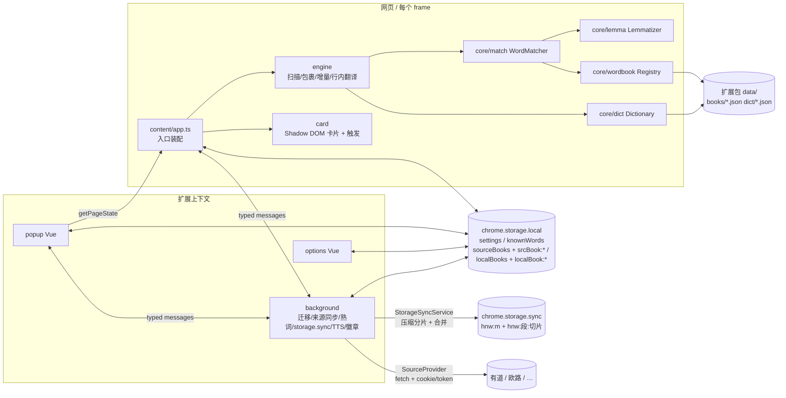
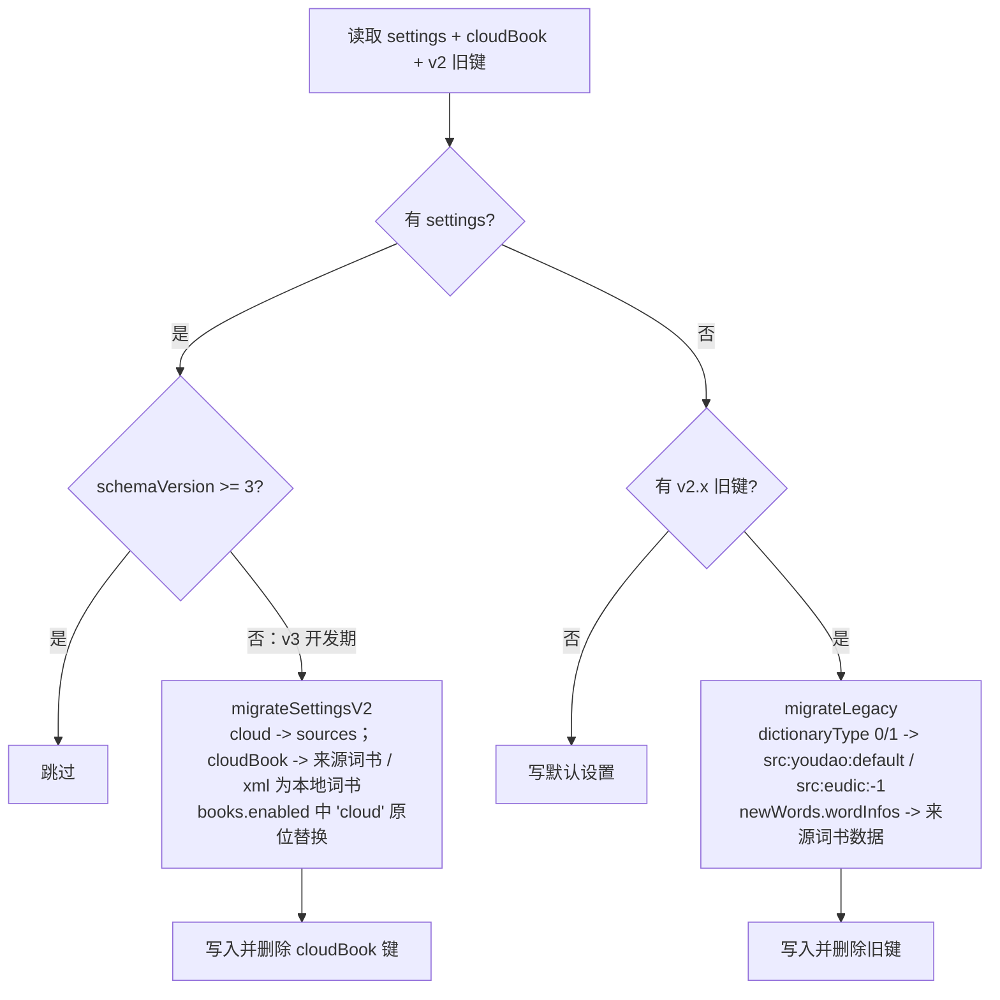
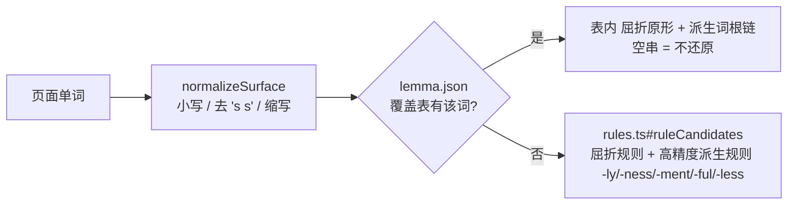
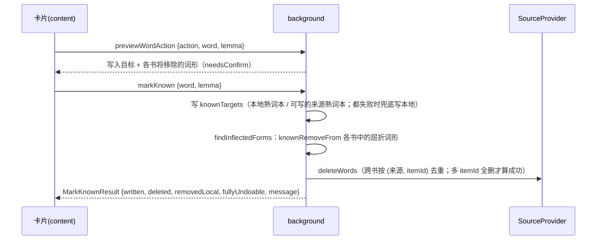
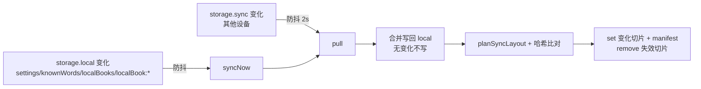

# 生词高亮扩展 v3 架构说明

[TOC]

## 一、技术栈

| 层 | 选型 | 说明 |
| --- | --- | --- |
| 扩展框架 | [WXT](https://wxt.dev) 0.21 | MV3；`srcDir=src`；关闭自动导入（`imports: false`），所有依赖显式 import |
| 语言 | TypeScript 5.9（strict + `noUncheckedIndexedAccess`） | `vue-tsc --noEmit` 做类型检查 |
| popup / options | Vue 3（`<script setup>`） | 样式方案：**纯 CSS 变量 + 组件 scoped CSS**，不引入 UI 框架/Tailwind；设计令牌在 [src/ui/tokens.css](../src/ui/tokens.css)，自动适配深浅色、触屏下点击区 ≥ 44px |
| 内容脚本 | 原生 DOM，无框架 | 页面内高亮用自定义标签 `hnw-mark`/`hnw-tr` + 注入 `<style>`；释义卡片在 Shadow DOM（`hnw-card-host`）中 |
| 单测 | Vitest + jsdom + WXT fake-browser | `tests/unit/**/*.test.ts` |
| 视觉 QA | Playwright 1.63（devDependency） | [scripts/qa/shot.mjs](../scripts/qa/shot.mjs) |
| 数据 | ECDICT（MIT）+ CEFR-J 1.5（署名免费商用）+ KyleBing 词表（BSD-3，仅词表） | [scripts/data/fetch-raw.sh](../scripts/data/fetch-raw.sh) 下载固定版本原始数据，[scripts/data/build-data.mjs](../scripts/data/build-data.mjs) 确定性生成 `public/data`（来源声明见 `public/data/NOTICE.txt`） |

目标浏览器：Chrome 与 Edge（含 Edge for Android），Edge 直接使用 chrome 构建产物（`npm run build:edge` 仅改输出目录名）。

## 二、整体结构



设计原则：

- **设置类变更不走消息**：任何上下文直接写 storage，其他上下文用 `storage.onChanged` 感知（内容脚本见 `startContentApp`，Vue 见 `useSettings`/`useBooks`）。本地导入词书、熟词本文本编辑同样由扩展页面直接写。
- **需要网络或跨数据协调的操作走 background 消息**：来源同步/删词、标记熟词与加入生词本（含来源词书的写入与删除）、storage.sync 状态。
- **匹配在内容脚本本地完成**：词书/词典按需从扩展包 fetch（`web_accessible_resources: data/*`），不逐词发消息。
- **大数据与设置分离**：`settings` 只放小对象；用户词书按“索引键 + 每本一个数据键”拆分，熟词本单独成键。
- **读改写加锁**：同一扩展源（background/扩展页面）的 storage 读改写走 `withStorageLock`（Web Locks API），内容脚本不做读改写。

## 三、目录与分片归属

后续并行开发按分片划分目录，**只改自己拥有的目录**；需要改动他人契约（下表“共享契约”）时，先在进度中说明并保持向后兼容。

| 分片 | 拥有的目录/文件 | 依赖的契约 |
| --- | --- | --- |
| data | `public/data/**`、`scripts/data/**`、`src/core/wordbook/registry.ts`（加载实现）、`src/core/dict/packaged.ts` | `BookCatalog`/`BookDataFile`/`DictShardFile`、`WordBookRegistry`、`Dictionary` |
| lemma | `src/core/lemma/**`、`public/data/lemma/**`（`lemma.json`）、`scripts/lemma/**`（数据生成）、`tests/fixtures/lemma-gold.tsv`（金标集） | `Lemmatizer` |
| engine | `src/content/engine/**`、`src/content/app.ts` | `WordMatcher`、`Dictionary`、`dom.ts` 常量 |
| card | `src/content/card/**` | `CardView`/`CardData`/`CardActions`、`CardStyle` |
| options | `src/entrypoints/options/**`（含导入 UI `LocalBooksSection`、熟词管理 UI `KnownSection`、来源 `SourcesSection`、同步 `SyncSection`）、`src/ui/components/**`（与 popup 共享，新增组件为主）、`src/core/import/parse.ts`（解析实现） | `Settings`、`useSettings`、`useBooks`、`BUILTIN_THEMES`、`ImportFormat`/`parseWordList`、user-store、known store、`SyncStatus` |
| popup | `src/entrypoints/popup/**` | 同上 + `getTabWords`/`getPageState`/`syncSourceBooks` 消息 |
| background | `src/background/**`（含来源 provider `src/background/sources/**`、熟词流程 `known.ts`）、`src/entrypoints/background.ts`、`src/core/sync/**`（storage.sync 同步层） | `BackgroundProtocol`、`SourceProvider`、settings/known/user-store |

**共享契约（改动需协调）**：`src/core/settings/**`、`src/core/messaging/**`、`src/core/storage/**`、`src/core/theme/**`、`src/core/match/**`、`src/core/source/**`、`src/core/known/**`、`src/core/wordbook/{ids,types,user-store,user-book,registry}.ts`（registry 加载实现仍归 data 分片完善）、`src/core/import/types.ts`、`src/core/sync/types.ts`、各模块 `types.ts`、`src/ui/composables/**`、`src/ui/tokens.css`、`wxt.config.ts`、`package.json`。

测试放 `tests/unit/<分片>*.test.ts`，fixture 页面放 `tests/fixtures/`（新增文件即可，不要改他人 fixture 的已有内容）。

## 四、核心契约

### 4.1 设置（Settings）

定义见 [schema.ts](../src/core/settings/schema.ts)，默认值见 `createDefaultSettings`，读写见 [store.ts](../src/core/settings/store.ts)。

| 字段 | 含义 |
| --- | --- |
| `updatedAt` | 最近修改时间，`saveSettings` 自动刷新；storage.sync 按此 LWW |
| `enabled` | 总开关（旧 `toggle`） |
| `books.enabled` | 启用词书 id 数组，三类词书可任意组合；顺序即优先级（id 规则见 4.2） |
| `style.themeId` / `style.custom` / `style.perBook` | 全局主题、自定义颜色（含旧版 4 个颜色）、按词书覆盖 |
| `inlineTranslation.mode` | `off` / `after`（词后）/ `ruby`（词上方，CSS `display:ruby`） |
| `card.trigger` | `auto`（桌面悬停 + 触屏点按）/ `hover` / `click` |
| `tts` | 自动发音开关、`voice`（`chrome.tts.speak` 选项）、语速 |
| `sources[providerId]` | 按来源配置 `SourceSettings`：`enabled`、`autoSync`（每天）、`deleteOnKnown`（默认 false，`wordActions.knownRemoveFrom='auto'` 时生效）、可选 `apiToken`（仅本机，不参与同步） |
| `knownBooks` | 熟词本多来源：`enabled` 启用的来源熟词本 id（角色为 known 的来源词书，如欧路“已掌握单词”，首次同步成功自动加入）；`roles` 用户为来源词书指定的角色 `new`/`known`（覆盖 provider 声明）。本地熟词本始终生效，见 4.9 |
| `wordActions` | 单词操作目标（见 4.9）：`sameLemma` 同原形开关（默认开）；`addTargets` 加入生词本写入的书（默认 `local:mine` “我的生词本”）；`addRemoveFromKnown` 加入时移出的熟词本（默认本地熟词本 `known:local`）；`knownTargets` 认识时写入的熟词本（默认 `known:local`）；`knownRemoveFrom` 认识时移除的生词本，`'auto'` = 沿用各来源 `deleteOnKnown` |
| `sync` | storage.sync 开关与 `include.{settings,knownWords,localBooks}`（本机字段，不参与同步） |
| `sites.disabled` | 禁用站点（含子域名，见 `isSiteDisabled`） |
| `ui.theme` | 扩展页面（popup/options）界面主题 `auto`/`light`/`dark`（options 分片新增，默认 `auto`）；页面在根元素设置 `data-theme`，`auto` 时不设置、跟随系统 |

**存储键**（[keys.ts](../src/core/storage/keys.ts)，`storage.local`）：

| 键 | 结构 | 写入方 |
| --- | --- | --- |
| `settings` | `Settings`（`SETTINGS_SCHEMA_VERSION = 3`） | 任意上下文 |
| `knownWords` | `KnownWordsData { words: 词→加入时间, removed: 词→撤销时间(墓碑) }` | background（markKnown）、options（编辑/导入）、sync |
| `sourceBooks` | `SourceBookIndex { books: id→SourceBookState, providers: id→{lastListAt, error} }` | background |
| `srcBook:<bookId>` | `SourceBookData { id, words: UserWordMap, updatedAt }` | background |
| `localBooks` | `LocalBookIndex { books: id→LocalBookMeta, removed: id→删除时间 }` | options、sync |
| `localBook:<bookId>` | `LocalBookData { id, words }` | options、sync |
| `syncState` | `SyncStatus`（用量/阶段/错误/设备 id） | background |

`storage.session` 中 `tabWords` 用于徽章；`storage.sync` 键见 4.9。

**迁移**：background 启动时调用 `runMigrationIfNeeded`：



v2.0.1 旧键 `toggle/ttsToggle/ttsVoices/highlight*/bubble*/dictionaryType/autoSync/syncTime/newWords.wordInfos` 全部保留迁移；旧 `cookie` 仅为记录用途（请求由浏览器自动带 cookie），不再迁移。旧用户只启用迁移出的来源词书，改过颜色的切到 `custom` 主题。新增字段只需在默认值中补齐，`normalizeSettings` 会深合并；不兼容调整需递增 `SETTINGS_SCHEMA_VERSION` 并在 migrate.ts 追加步骤。

### 4.2 词书与词典

词书分三类，id 规则见 [ids.ts](../src/core/wordbook/ids.ts)（`parseBookId` / `sourceBookId` / `localBookId`）：

| 类别 `BookKind` | id | 数据 | 元数据 |
| --- | --- | --- | --- |
| `builtin` 内置分级 | catalog id，如 `cet6` | 扩展包 `data/books/<id>.json` | `CatalogBookMeta` |
| `source` 来源词书 | `src:<providerId>:<encodeURIComponent(remoteId)>` | `srcBook:<id>` | `SourceBookState`（同步状态） |
| `local` 本地导入 | `local:<uuid>` | `localBook:<id>` | `LocalBookMeta`（名称/格式/词数） |

- `WordBookRegistry`（[types.ts](../src/core/wordbook/types.ts)）：`list()` 返回三类统一的 `BookMeta[]`（用户词书在前，`kind`/`category='user'`/`providerId`/`sync`/`importFormat` 等元数据），`load(id)` 懒加载并缓存 `WordBook { has, size, words(), entry?(word) }`。用户词书由 `createUserWordBook` 包装，`entry` 返回自带的 `UserWord { word, phonetic, trans, ref }`（`ref` 为 provider 删除句柄）。实现 `DefaultWordBookRegistry` 通过 `RegistryLoaders` 注入数据源，`createExtensionLoaders()` 为运行时实现。
- 用户词书读写：[user-store.ts](../src/core/wordbook/user-store.ts)（`getSourceIndex`/`patchSourceBookState`/`saveSourceBook`、`saveLocalBook`（新建或覆盖导入）/`renameLocalBook`/`deleteLocalBook`（留墓碑））。
- 打包数据格式：
  - `data/books/index.json`：`BookCatalog { version: 2, books: CatalogBookMeta[] }`，已按 分类 → 难度 排序；增量书带 `delta { of, minus }`
  - `data/books/<id>.json`：`BookDataFile { id, words: string[], extends?: BookId[] }`（小写原形、已排序）。级别/词频书是包含关系，只存比 `extends` 多出的词，`DefaultWordBookRegistry` 加载时递归合并并缓存共享文件
  - 词典两层分片（首字母 `a-z`）：短表 `data/dict/<c>.json` = `{ word: { p 音标, s 行内短释义(单义项、无词性、≤8 字), g 考试标签, l 级别 1–6, r 词频排名 } }`；全表 `data/dict/full/<c>.json` = `{ word: { f 完整释义(每行一个词性), x 词形 "s:widths/p:…" } }`。旧格式（f 在短表）仍兼容
- `Dictionary`（[dict/types.ts](../src/core/dict/types.ts)）：`DictEntry { word, phonetic, short, full, tags, level?, rank?, forms? }`。**`lookupMany` 只读短表**（整页行内翻译，不含 full/forms），**`lookup` 额外加载全表**（卡片/详情用）；`CompositeDictionary.lookup` 逐来源调用 `lookup`。辅助：`cefrLabel(level)`、`DICT_FORM_LABELS`。内容脚本使用 `CompositeDictionary([UserBooksDictionary(启用的用户词书), PackagedDictionary])`，用户词书自带释义优先（按启用顺序取第一本有释义的）。

内置词书（`BookCategory` 新增 `level`；`popup` 等按分类穷举的 `Record<BookCategory, …>` 需补该键）：

| 分类 | id | 规则 |
| --- | --- | --- |
| `level` 难度分级（包含体系） | `cefr-a2 cefr-b1 cefr-b2 cefr-c1 cefr-c2` | 选 B2 = 高亮 B2+C1+C2，低于所选级别视为已会。A1–B2 取 CEFR-J（中考词至多 A2）；CEFR-J 外的词按词频：前 1500 视为 B1，前 8000 或带中考~托福标签为 C1，其余（COCA/BNC 前 2 万内或带考试标签）为 C2 |
| `exam` 考试 | `zk gk cet4 cet6 kaoyan tem4 ielts toefl sat tem8 gre` | ECDICT 标签（SAT/专四/专八取 KyleBing 词表），变形词归原形、去专有名词/叹词/缩写，再按书去掉低于考试起点的 CEFR 基础词（高考去 A1，四级去 A1–A2，六级/考研/雅思/托福/专四去 A1–B1，SAT/专八/GRE 去 A1–B2） |
| `exam` 增量（`delta`） | `gk-new cet4-new cet6-new kaoyan-new ielts-new toefl-new gre-new` | 如六级新增 = 六级 − 中考/高考/四级原始词表 |
| `frequency` 词频 | `coca-3k coca-5k coca-8k coca-12k` | COCA（缺失用 BNC）排名前 N 之外、级别 ≥ B1 的词 |

默认启用的 `cet6` 在 [article.html](../tests/fixtures/article.html) 上标出约 86 个不同原形（Relingo B2 约 79 个），对照 Relingo B2 判定的回归见 `tests/unit/data.test.ts`。

### 4.3 词形还原（Lemmatizer）

```ts
interface Lemmatizer {
  init?(): Promise<void>;
  candidates(surface: string): string[];
  // 可选（lemma 分片新增，向后兼容）：区分屈折与派生，卡片可据此显示“过去式 / 派生自 care”
  analyze?(surface: string): LemmaAnalysis; // { base, inflections, derivations, fromTable }
}
```

`candidates` 第一个元素必须是小写原词，之后为候选原形（去重、小写）。全项目通过 `createLemmatizer()` 获取实例（`DataLemmatizer`），调用方需 `await init()` 加载数据，未加载或加载失败时退化为纯规则。

候选顺序：`[小写原词, 去所有格/缩写形式, ...屈折原形, ...派生词根链]`，如 `children's → children's, children, child`、`carelessly → carelessly, careless, care`。匹配取第一个在启用词书中的候选，因此原词在词书中时总是按原词命中；熟词判定看全部候选（标记 care 为熟词后 careless/carelessly 也不再高亮）。

“规则 + 覆盖表”结构：



- 规则与数据：[rules.ts](../src/core/lemma/rules.ts)（无依赖纯函数，构建脚本与运行时共用）、[data-lemmatizer.ts](../src/core/lemma/data-lemmatizer.ts)（`candidates` / `analyze` / `lemma` / `root`）、`public/data/lemma/lemma.json`（`LemmaDataFile { v: 1, e: { 词: "屈折1,屈折2|派生1,派生2" } }`，约 360KB）。
- 生成：`node scripts/lemma/build-lemma-data.mjs <ecdict.csv> <lemma.en.txt> [out] [--report]`（ECDICT exchange + BNC 词形表，MIT）。词汇表 = 考试词 + 词频前 3 万 + 其屈折变形；对每个词算出真值（屈折原形 + 经中英文释义语义校验的派生词根链），运行时规则输出与真值不一致的才写表，所以词汇表内的词结果精确（went→go、better→good、business/news/hardly/corner 不还原），词汇表外长尾词走规则。**改了 rules.ts 必须重新生成 lemma.json。**
- 测试：金标集 [lemma-gold.tsv](../tests/fixtures/lemma-gold.tsv)（屈折/不规则/复数/比较级/所有格/派生/不应还原，含“禁止误还原”列）在 `tests/unit/lemma.test.ts` 中校验；与 wink-lemmatizer、compromise 的对标评测见 `tests/unit/lemma-bench.test.ts` 文件头（标杆库装在临时目录，不进依赖）。

### 4.4 匹配服务（WordMatcher）

`WordMatcher#match(surface)` → `MatchResult { surface, lemma, bookIds } | null`：

1. 任一候选在熟词本中 → 不匹配（熟词优先）
2. 按候选顺序取第一个出现在任一启用词书中的候选作为 `lemma`
3. `bookIds` 为包含该 lemma 的启用词书（按优先级），首个决定样式

`findWordFormsOfLemma(lemma, words, lemmatizer)`（[forms.ts](../src/core/match/forms.ts)）复用 WordMatcher 判定“高亮意义上同原形”的词形，**含派生词**（runner→run），只用于展示/统计。删除、移除一律用 background 的 `findInflectedForms`（[background/forms.ts](../src/background/forms.ts)），只认屈折变化，见 4.9。

### 4.5 内容引擎与卡片

- DOM 约定见 [dom.ts](../src/content/engine/dom.ts)：`<hnw-mark data-lemma data-book data-books [data-hnw-dark] [data-hnw-active]><hnw-w>原词</hnw-w><hnw-tr data-tr="译"></hnw-tr></hnw-mark>`（engine 第 1 轮调整，`hnw-mark`/`hnw-tr`/`data-lemma` 等原有选择器不变）：
  - 主题样式只作用于 `hnw-w`，释义不被染上高亮背景/下划线；释义文本放在 `data-tr` 属性、由 `::before` 渲染，不进入页面 textContent（复制、查找、页面脚本不受影响），读取释义用 `getAttribute('data-tr')`，读取原词用 `markSurface`。
  - `data-hnw-dark`：engine 按 mark 父元素的计算文字色判断深色上下文（浅色文字≈深色背景），文字色类主题在深色上下文自动提亮到 4.5:1；页面切换明暗（html/body 属性、`prefers-color-scheme`）时重算。
  - `data-hnw-active`：卡片锚定单词，由 card 分片设置并提供样式。
  - `<html data-hnw-tr="off|after|ruby">` 控制行内翻译：`after` 为词后灰色括注 `(译)`（inline-block 不断行）；`ruby` 为原生 CSS ruby（`display:ruby`，注解居中、最小 10px，只在需要的行增加行高、不与上一行重叠）。样式由 `buildPageCss` 生成。
- 扫描：`createTextWalker` 用 TreeWalker，跳过 script/style/code/pre/textarea/input/select/svg/contenteditable 及自身节点；engine 逐个 `nextNode()` 边取边处理，可在任意节点处让出主线程。
- 包裹：`highlightTextNode` 用 `splitText` 从后往前切分。**不变式：页面原始文本节点永远留在原位置**（首词命中时切成空串），其后的 mark 与剩余文本登记为它的“切分组”片段（`restoreGroup`/`dropGroup`）。框架改写原节点 `nodeValue` → 丢弃旧片段重做；框架删除/移动原节点 → 片段文字拼回原节点并移除片段；`removeChild(原节点)` 不会抛错。
- 增量：`HighlightEngine` 用 MutationObserver（childList + characterData），队列在 `requestIdleCallback` 中按 4–12ms 时间片处理，每片先写后统一读计算样式；自身改动通过 `takeRecords()` 丢弃。
- 熟词即时生效：`removeLemma(lemma)` 先把词条加入抑制集合，再同步重做含该词条的切分组（所有词形一起消失，释义取缓存不闪烁），存储写入后 `refreshMatches` 复核。
- 数据变化：启用词书变化 → `rebuild` 全量重扫；新增熟词/用户词书删词（只减少命中）→ `refreshMatches` 原地复核；用户词书新增词 → 全量重扫；样式/翻译模式 → 仅更新样式。只监听 `settings`、`knownWords`、`srcBook:*`、`localBook:*`，忽略 `syncState` 等后台元数据写入。
- 卡片：`CardView` 接口（[card/types.ts](../src/content/card/types.ts)）；`CardData.deletableBooks` 为命中的、provider 支持删除的来源词书；`CardActions` 为 `markKnown(lemma, surface) → MarkKnownResult`、`unmarkKnown(lemma)`（撤销）、`deleteFromSources(lemma, bookIds)`，均转发 background 消息。当前实现 `ShadowCardView`（open 模式 Shadow DOM，便于测试穿透）：视口 ≤ 600px 或无悬停能力的触屏设备显示底部卡片（近全宽、可下滑关闭、触控目标 ≥ 44px，单词被遮挡时自动滚到卡片上方），否则为贴词浮层（滚动时跟随单词，单词离开视口关闭）；暗色页面自动换暗色卡片；“认识”后关闭卡片并弹出可撤销 toast；来源删除为两步确认。打开期间给锚点加 `data-hnw-active` 属性，并由卡片注入 `<style id="hnw-card-active-style">` 显示激活态（叠加渐变，不覆盖 engine 的高亮样式）。纯函数（词形关系说明、释义分行、音标规范化、外部词典链接）在 [word-info.ts](../src/content/card/word-info.ts)。触发逻辑 `bindCardTrigger`：鼠标悬停 100ms 打开、触屏点按打开并阻止链接跳转（再次点按放行）；鼠标在外部按下 / 触屏在外部点按（滑动滚动不关闭）/ Esc 关闭，页面滚动不再由 trigger 关闭。
- 卡片可选契约（向后兼容，入口未接入时不显示）：`CardData.collected?: boolean` + `CardActions.setCollected?(lemma, surface, collected)` 用于“加入/移出生词本”（收藏）按钮。background 已提供消息：`getWordState`（收藏状态）、`addWord`/`removeWord`（收藏/取消，目标按 `wordActions` 配置）、`previewWordAction`（执行前预览，`needsConfirm=true` 时卡片应列出将从来源删除的词让用户确认），由 `app.ts` 注入。

### 4.6 消息契约

定义见 [protocol.ts](../src/core/messaging/protocol.ts)，收发封装见 `sendToBackground` / `handleBackgroundMessages` / `sendToTab` / `handleContentMessages`。

| 方向 | 消息 | 参数 → 返回 |
| --- | --- | --- |
| → background | `tts` | `{text, force?}` → `{spoken, reason?}`（`unavailable`=无 chrome.tts，调用方可退回页面 speechSynthesis；本机不存在的 voiceName 自动退回按 lang） |
| → background | `refreshSourceBooks` | `{providerId}` → `SourceBookState[]`（列远端生词本，新书 status=never，消失的标 orphaned） |
| → background | `syncSourceBooks` | `{bookIds?, providerId?}` → `SourceSyncResult[]`（逐本独立；无登记的书时先刷新列表） |
| → background | `deleteSourceWords` | `{word, bookIds?, forms?}` → `DeleteWordsResult`（远端成功才移除本地缓存；`forms` 只含屈折词形） |
| → background | `markKnown` | `{word, lemma}` → `MarkKnownResult`（按 `wordActions` 写熟词本 + 从生词本移除屈折词形；`written`/`removedLocal`/`fullyUndoable` 为第 2 轮新增可选字段） |
| → background | `unmarkKnown` | `{lemma}` → `{ok, restored?, message?}`（10 分钟内撤销：本地词书完整恢复，来源词书加回可写的原书，不可写时加回同来源可写书并在 message 说明；记录存 `storage.session` 的 `knownUndo`） |
| → background | `addWord` | `{word, lemma, trans?, phonetic?}` → `AddWordResult`（写入 `addTargets`，移出 `addRemoveFromKnown`） |
| → background | `removeWord` | `{lemma, bookIds?}` → `RemoveWordResult`（移出生词本；10 分钟内会把加入时移出的熟词加回） |
| → background | `previewWordAction` | `{action:'add'\|'known', word, lemma}` → `WordActionPreview`（只读本地缓存，列出写入目标和各书将移除的词形，`needsConfirm` 表示含远端删除） |
| → background | `getWordState` | `{lemma}` → `{collected, collectedIn, known}` |
| → background | `getSyncStatus` | `{}` → `SyncStatus` |
| → background | `syncNow` | `{}` → `SyncStatus`（立即 pull + push） |
| → background | `reportPageWords` | `{lemmas}`（本 frame 全量）→ void，用于徽章 |
| → background | `getTabWords` | `{tabId}` → `{lemmas}` |
| → content（顶层 frame） | `getPageState` | `{}` → `PageState` |

新增消息：在对应 Protocol 接口加一项，TS 会强制接收方 handlers 实现。

### 4.7 主题

[themes.ts](../src/core/theme/themes.ts) 定义 `MarkStyle`/`CardStyle`/`HighlightTheme` 和 `BUILTIN_THEMES`（含旧版 5 套配色），`resolveMarkStyle`/`resolveCardStyle`/`markStyleToCss` 在内容脚本与 options 预览中共用。已有主题 id 不可修改（用户设置中保存的是 id）。

**选项页外观约定（options 分片）**：

- 内置预设新增 `orange-text`/`teal-text`/`dashed-orange`/`wavy-red`/`underline-tint`/`marker-lime`（只追加，不改旧 id）；`legacy-*` 在 UI 中折叠为“旧版配色”。
- 自定义样式 = “样式类型 × 主色”（[palette.ts](../src/ui/components/palette.ts) 的 `buildMark`/`tintMark`/`markKind`），按词书分色时 `perBook[id].mark` 存与全局同类型、不同颜色的完整 `MarkStyle`；全局样式类型变化时由 options 按各自主色重新着色（`retintPerBook`）。
- 实时预览（`LivePreview`）直接调用 engine 的 `highlightTextNode`/`setMarkTranslation`/`buildPageCss` 生成 DOM 与样式（把 `html[data-hnw-tr=…]` 替换为容器属性选择器），engine 调整 DOM 结构或样式时预览自动一致，请保持这三个导出的签名。
- [tokens.css](../src/ui/tokens.css) 支持 `:root[data-theme="light|dark"]` 强制主题，新增 `--success/--warn/--danger-soft/--overlay/--radius-lg` 令牌。
- 选项页路由为 hash：`#books`/`#appearance`/`#sources`/`#known`/`#more`，可带页内锚点（如 `#appearance/per-book`、`#sources/import`）；`#welcome` 为首次使用引导，background 可在 `onInstalled(reason=install)` 时打开 `options.html#welcome`。

### 4.8 生词本来源（Source Provider）

契约见 [source/types.ts](../src/core/source/types.ts)，分两层：

- `SourceProviderInfo`（静态，任何上下文可用，登记在 [providers.ts](../src/core/source/providers.ts) 的 `SOURCE_PROVIDER_INFOS`）：`id`、`name`、`capabilities { delete, multiBook, requiresCookie, apiToken, canAdd?, knownBooks?, notes? }`（`notes` 为能力限制的中文说明，UI 直接展示）、`loginUrl`、`tokenUrl?`
- 每本远端书的能力随列表刷新写入 `SourceBookState`：`role`（`new`/`known`）、`canAdd`、`canDelete`、`readOnlyReason`（不能写入的原因），以及 `entryCount`（远端条目数，大小写不同的重复条目各算一条）。provider 在 `RemoteBook` 中声明这些字段。
- `SourceProvider extends SourceProviderInfo`（background 专用网络实现，[background/sources](../src/background/sources)）：`listRemoteBooks(ctx)`、`fetchWords(remoteBookId, ctx)`（带音标/释义；同一单词多个远端条目时 `UserWord.refs` 列出全部句柄）、`deleteWords(remoteBookId, words, ctx) → { deleted, failed }`（多句柄词条全部删除成功才算 deleted）、可选 `addWords(remoteBookId, words, ctx) → UserWord[]`（加入生词本、撤销时加回，返回带新删除句柄的词条）、可选 `verifiesLoginOnEmpty`（空结果前已确认登录）、可选 `globalRefs`（句柄在来源内全局唯一，如有道 itemId，删除时跨书去重）；`ctx.settings` 为该来源的 `SourceSettings`；可抛 `SourceError(message, code)`，`code` 新增 `ratelimit`（向后兼容）

| 来源 | 远端生词本 | 拉取 | 删除 |
| --- | --- | --- | --- |
| 有道（2026-10 调试账号实测） | `webapi/books` 各分组（默认“无标签” bookId=`0`）；旧版迁移的 `default` 表示全部单词 | `webapi/words?limit&offset&bookId`；同一单词可有大小写不同的多个条目（调试账号有 14 组、28 个条目），按小写合并并保留全部 itemId | 按 itemId 逐个 `webapi/delete`；加词 `webapi/v2/ajax/add` 只能加到默认分组，所以只有分组 `0` 的 `canAdd=true` |
| 欧路（cookie，默认） | `-1` 全部生词（cookie 分类接口未公开） | `my.eudic.net/StudyList/WordsDataSource` 不带分类（同旧版），分页 4000 | `Dicts/SetStarRating rating=-1`；不能加词 |
| 欧路（OpenAPI token，2026-10 实测） | `GET /studylist/category` 各分类 + `mastered`“已掌握单词”（`role=known`，只读） | `GET /studylist/words?category_id&page(0~50)&page_size(≤100)`；已掌握 `GET /studylist/mastered_words` | `DELETE /studylist/words`（204）；加词 `POST /studylist/words`（201）；已掌握没有写接口 |

真实接口要点：有道**未登录时所有接口仍返回 `code:0`**（列表为空、删除“成功”），provider 用 `login/acc/query/accountinfo`（未登录 `code:2035`）区分，删除前必须校验登录；欧路 OpenAPI 401=授权失效、403=限流（1 分钟 30 次 / 30 分钟 500 次，超限封 1~24 小时），所有 OpenAPI 请求全局串行间隔 ≥ 2.1s。脱敏响应样例见 [tests/fixtures/sources](../tests/fixtures/sources)。

同步服务 [service.ts](../src/background/sources/service.ts)：

- `syncSourceBook` 逐本独立更新状态（`syncing → ok / empty / error`），同一本书并发调用复用同一任务；空结果不覆盖缓存，返回 `ok:true, empty:true`；首次同步成功自动启用：角色为 new 的加入 `books.enabled`（若同来源有已启用的孤儿书，插到它的位置），角色为 known 的加入 `knownBooks.enabled`（绝不进高亮词书）
- 按来源同步（`providerId` 或全部来源）总是先刷新列表；刷新失败（未登录/限流）时不逐本请求，直接把该来源各书标 error；同步后把被新书取代的已启用孤儿书（如迁移来的 `src:youdao:default`）移出启用列表，缓存保留
- SW 被回收导致停在 `syncing` 的书在启动时复位为 error（`recoverInterruptedSyncs`）
- `autoSyncIfDue` 在 SW 每次启动时检查：来源启用且 `autoSync`；同步过的来源要有书超过 24 小时未同步且距上次尝试超过 1 小时；从未同步成功的来源（与旧版 syncTime=0 一致）距上次尝试超过 24 小时即自动尝试

**新增来源**：① 在 `SOURCE_PROVIDER_INFOS` 加静态描述；② 在 `background/sources/` 实现 `SourceProvider` 并加入 `background/sources/index.ts` 的 `PROVIDERS`；③ 在 `createDefaultSettings` 的 `sources` 中补默认配置。UI 自动按 `SOURCE_PROVIDER_INFOS` 渲染。

### 4.9 熟词本、加入生词本与移除目标

熟词本与生词本使用同一套“来源 + 多本”模型（[known/sources.ts](../src/core/known/sources.ts)）：

- 本地熟词本（storage `knownWords`，参与 storage.sync）始终生效；来源熟词本 = 生效角色为 known 的来源词书（provider 声明或 `knownBooks.roles` 覆盖），在 `knownBooks.enabled` 中启用后生效。
- `getKnownWords()` 返回两者的并集，内容脚本的 WordMatcher 用它判定熟词（熟词优先于生词）。只编辑本地熟词本的地方（options 熟词管理、storage.sync）用 `getKnownData`。

单词操作在 [background/known.ts](../src/background/known.ts)，目标配置为 `settings.wordActions`。目标 id 可以是本地词书 `local:…`、来源词书 `src:…`，或本地熟词本 `known:local`。不支持的目标（如欧路“已掌握”只读、有道非默认分组不能加词）会跳过，结果中带 `skipped` 和原因。



- **删除集合只含屈折变化**（`findInflectedForms`）：生词本中的词 w 只有在 w 就是原形，或 w 经屈折还原（复数、三单、-ed、-ing、比较级以及 went/gone/better 这类不规则形，来自 `Lemmatizer#analyze().inflections`）等于原形时才会被删除。派生词（runner、careful、careless、carelessly、ability）永远不删。数据表外的词按规则还原时，-er/-est 不还原（runner 不当作 run 的比较级）。同原形开关 `sameLemma` 关闭时只处理当前词形和原形本身。
- **来源删除的保护**：只对可删的书（未孤立、`canDelete`、provider 支持删除）发请求；`globalRefs` 的来源（有道）跨书按句柄去重，删除成功后同步清理其他书（含迁移来的孤儿书）缓存中的同一条目；任何失败都保留本地缓存并在文案中说明。
- `knownRemoveFrom='auto'`（默认）等同旧开关：启用的来源中开启 `deleteOnKnown` 的全部生词本。
- **撤销**（10 分钟，记录在 `storage.session` 的 `knownUndo`，键为 `known:<lemma>` / `add:<lemma>`）：本地词书完整恢复；来源词书原书可加词时加回原书，否则加回同来源可写的书（有道默认分组）并说明，都不行时在文案中列出无法加回的词；撤销认识时还会删除写入来源熟词本的词。
- “加入生词本”默认写入“我的生词本”（`local:mine`，首次加入时自动创建并放到 `books.enabled` 最前），并从本地熟词本移除该词的屈折词形；词仍在启用的只读来源熟词本中时，文案提示“仍不会高亮”。

熟词本存储见 [known/store.ts](../src/core/known/store.ts)：`getKnownData`（本地熟词本）、`getKnownWords`（生效并集）、`setKnownWords`、`replaceKnownWords`（文本编辑，删除的记墓碑）、`importKnownWords`、`exportKnownWords('txt'|'csv')`。合并规则见 `mergeKnownWords`。

### 4.10 手动导入

契约见 [import/types.ts](../src/core/import/types.ts)：`ImportFormat = txt | csv | tsv | youdao-xml | eudic | anki`，`parseWordList({text, fileName?, format?='auto'}) → ImportResult { format, words: UserWord[], skipped, warnings }`。解析实现 [parse.ts](../src/core/import/parse.ts)（`detectImportFormat` 按扩展名与内容嗅探；CSV 支持引号与表头列名识别；Anki 支持 `#separator`/`#guid column` 等指令；XML 依赖 DOMParser，只能在页面上下文调用）。导入结果经 `saveLocalBook` 存为本地词书（传 `id` 即覆盖导入）。熟词本导入复用同一解析。

**新增格式**：`ImportFormat` 加一项 → `IMPORT_FORMATS` 加 UI 选项 → `parse.ts` 的 `PARSERS` 与 `detectImportFormat` 补齐。

### 4.11 storage.sync 同步

实现在 [core/sync](../src/core/sync)（归 background 分片），background 中只实例化一个 `StorageSyncService`。

- **段与编码**：数据切成段，每段 `JSON → deflate-raw（CompressionStream）→ base64`（`encodeSyncValue`），按单项上限切片：
  - `settings`（`pickSyncedSettings`：去掉 `sync` 与 `apiToken`）、`known`、`lbr`（本地词书删除墓碑）、`lb:<uuid>`（每本本地词书一段）；来源词书不同步
  - `storage.sync` 键：`hnw:m` 为 `SyncManifest { v, device, at, segs: 段→{kind, n 切片数, h 哈希, at, level}, parts? }`，切片为 `hnw:<段>:<i>`；段目录超过单项上限时 manifest 分片，其余片在 `hnw:m:<i>`（`{ segs }`，最多 16 片），与切片同批写入；读取时缺片的段视为未知，不拉取也不当作删除
- **配额与取舍**（`planSyncLayout`，纯函数）：按优先级 settings(0) → known(1) → lbr(2) → 本地词书(10+，小书优先) 依次放入；本地词书先尝试完整，再降级为仅单词（`reduced`），仍放不下则 `skipped`；保证总字节 ≤ `QUOTA_BYTES - 预留`、项数（含 manifest 分片）≤ `MAX_ITEMS`、单项 ≤ `QUOTA_BYTES_PER_ITEM`。用量 `SyncUsage` 写入 `syncState` 供 UI 展示。
- **写频率**：本机变化防抖 5s，连续改动时最多等待 30s（maxWait，从第一次未推送的改动算起），两次推送间隔 ≥ 10s，本机写操作按滑动窗口自我限额（Chrome 上限的 80%：每分钟 96、每小时 1440）。每次推送最多 1 次 `set`（切片与 manifest 同批）+ 1 次 `remove`，只重写哈希变化的段。遇到 `MAX_WRITE_OPERATIONS_PER_MINUTE` 退避 60s；遇到 `PER_HOUR` 按本机写入记录推算窗口释放时间（无记录时退避 1 小时）。退避截止时间写入 `syncState.retryAt`（SW 重启后仍遵守），退避期间 `phase=pending`、`error` 清空、`notice` 说明何时自动重试，手动同步只拉取。内容比较一律用 `stableStringify`（Chrome 读回的对象键按字母序，直接 `JSON.stringify` 比较会导致每次同步都重写）。熟词段用紧凑编码 [known-codec.ts](../src/core/sync/known-codec.ts)（秒精度，超配额降级为天精度）。拉取时段哈希与 manifest 不符或解码失败只跳过该段。
- **合并**（[merge.ts](../src/core/sync/merge.ts)）：设置按 `updatedAt` LWW 且保留本机字段；熟词并集 + 墓碑（墓碑保留 180 天）；本地词书每本按 `updatedAt` LWW，墓碑时间 ≥ 更新时间则删除；超配额被跳过的书不视为删除。全新安装的默认设置 `updatedAt=0`、旧版迁移结果 `updatedAt=1`，新设备首次同步时远端设置胜出。
- **用户开关**：`settings.sync.enabled` 关闭后不读写 storage.sync；`include` 中关闭的类别不推送也不拉取，但保留远端已有段（`kept`，可能是其他设备的数据）。



合并写回本机会再次触发推送，但此时规划与远端一致，不产生写操作，不会循环。

## 五、命令与 OUT_DIR 约定

| 命令 | 说明 |
| --- | --- |
| `npm run dev` | WXT 开发模式（不自动开浏览器），产物 `.output/chrome-mv3-dev` |
| `npm run build` | 生产构建，产物 `${OUT_DIR:-.output}/chrome-mv3` |
| `npm run build:edge` | 产物 `.../edge-mv3`（与 chrome 构建一致） |
| `npm run typecheck` | `vue-tsc --noEmit` |
| `npm test` | Vitest 单测 |
| `npm run qa:shot -- --ext <dir> ...` | 视觉 QA 截图 |
| `scripts/data/fetch-raw.sh .cache/data-raw [--with-ultimate]` 后 `node scripts/data/build-data.mjs --raw .cache/data-raw` | 生成内置词书/词典数据（约 6 秒，输出确定性；`--with-ultimate` 用 ECDICT-ultimate 改善短释义排序） |

**OUT_DIR**：多个 agent 并行构建时，各自设置不同输出根目录，避免互相覆盖：

```bash
OUT_DIR=/tmp/gauntlet/out/engine npm run build
node scripts/qa/shot.mjs --ext /tmp/gauntlet/out/engine/chrome-mv3 --out /tmp/gauntlet/shots/engine --tap auto --ui popup,options
```

注意 `npm run build` 会先清空 `OUT_DIR` 下对应的浏览器子目录。

## 六、视觉 QA 脚本

[scripts/qa/shot.mjs](../scripts/qa/shot.mjs) 不负责构建，参数详见脚本头部注释，常用：

- `--pages article,dark,dynamic`：本地 fixture（[tests/fixtures](../tests/fixtures)，长新闻页 / 深色页 / 动态插入的密集页），通过脚本内置 HTTP 服务提供
- `--url <url>`：额外截线上页面
- `--sizes mobile,desktop`：mobile = 390×844、触屏、DPR 2、Edge Android UA；desktop = 1280×800
- `--tap <lemma|auto>`：mobile 点按 / desktop 悬停一个高亮词，额外截卡片图
- `--ui popup,options`：截扩展页面（popup 通过 `?tabId=` 指向第一个页面）
- `--settings '<json>'`、`--seed '<json>'`：通过扩展 service worker 写入 storage 播种

stdout 输出每页统计 JSON（高亮数、不同词条数、行内翻译数、页面错误、卡片是否打开）。

## 七、已知缺口

- 内置短释义不看上下文（present→介绍、concrete→混凝土的），按多来源义项位次投票选取；ECDICT 考试标签不是官方大纲（四级约 3.8k 词，少于官方 4.5k）；ECDICT 小写词条与人名同形（tom）在 C2 书中可能误标首字母大写的人名。
- 词形还原不带词性：同形异义词按数据取最常见原形（leaves → leave, leaf 都作候选）；派生关系靠 ECDICT 释义做语义校验，个别派生词因释义不重叠而漏还原（unhappiness、sailor），前缀派生（un-/re-）不还原。
- popup/options 文案仅中文，未接入 `_locales` 国际化；卡片暂无例句；收藏（加入我的生词本）按钮待 background/engine 接入 `setCollected`。
- 欧路 OpenAPI 已用调试账号 token 实测（分类、拉词、已掌握、在“测试”分组加词/删词）；cookie 模式沿用旧版接口，未登录判断（非 JSON / 重定向到登录页）为推断，未实测。
- 欧路 cookie 模式删除（SetStarRating）作用于整个生词本，不区分分类；“已掌握单词”只读，OpenAPI 没有写入接口。
- storage.sync 在真实 Chromium 中验证了配额（自算用量与 `getBytesInUse` 误差 < 50 字节）与无变化不重写，未做真实多设备验证。
- 撤销熟词时有道非默认分组的词只能加回默认分组“无标签”（文案会说明）；欧路 cookie 模式无加词接口，无法加回（`MarkKnownResult.fullyUndoable=false`）。
- 屈折还原数据中的同形异义词（lay 是 lie 的过去式也是原形动词、found 是 find 的过去式也是原形）会按屈折处理：标记 lie 会删除生词本中的 lay。卡片应在 `previewWordAction.needsConfirm` 时列出将删除的词。
- storage.sync 的防抖/退避计时器在 SW 被回收后丢失，未推送的改动在 SW 下次启动时由启动同步补推（没有使用 alarms 权限）。
- 徽章：background 在 URL（不含 hash）变化时清零（含 SPA 路由），依赖内容脚本在路由切换后按页面实际高亮重新全量上报。
