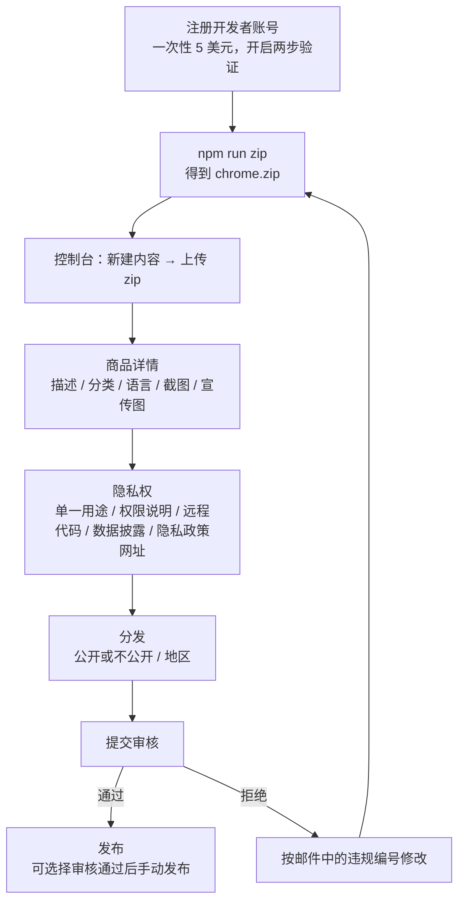
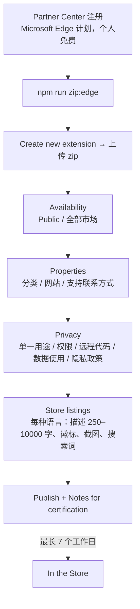

# 发布与上架说明

[TOC]

## 一、范围

| 目标 | 构建 | 发布渠道 | 状态 |
| --- | --- | --- | --- |
| Chrome（桌面） | chrome 产物 `chrome-mv3` | Chrome 网上应用店 | 上架 |
| Microsoft Edge（桌面、Edge for Android） | 与 chrome 产物相同（`edge-mv3` 只是目录名不同） | Microsoft Edge 加载项（Partner Center） | 上架 |
| Firefox（桌面、Android） | firefox 产物 `firefox-mv3`（MV3，后台为事件页） | 无 | **仅开发调试，暂不上架** |

商店材料都在 [store/](../store)：

| 文件 | 内容 |
| --- | --- |
| [listing.zh_CN.md](../store/listing.zh_CN.md) / [listing.en.md](../store/listing.en.md) | 名称、简短描述、两家商店的详细描述、Edge 搜索词、分类 |
| [permissions.md](../store/permissions.md) | 单一用途、逐项权限说明、远程代码、数据使用披露（隐私表单填写稿） |
| [privacy-policy.md](../store/privacy-policy.md) / [privacy-policy.en.md](../store/privacy-policy.en.md) | 隐私政策（需公开托管） |
| [review-notes.md](../store/review-notes.md) | 审核备注（Edge “Notes for certification”），含 YouTube 字幕、手机悬浮球的测试步骤与云端来源默认不连接的说明 |
| [images/](../store/images) | 截图（中英各 6 张：Chrome 传 1–5，Edge 全传）、宣传图、商店图标、Edge 徽标；`raw/` 为真实运行原图 |
| [scripts/](../store/scripts) | `capture.mjs` 采集原图，`render.mjs` 套模板出图 |

## 二、构建与打包

| 命令 | 产物（`${OUT_DIR:-.output}` 下） | 用途 |
| --- | --- | --- |
| `npm run zip` | `highlight-new-words-<版本>-chrome.zip` | 上传 Chrome 网上应用店 |
| `npm run zip:edge` | `highlight-new-words-<版本>-edge.zip` | 上传 Edge 加载项 |
| `npm run zip:stores` | 以上两个 | 发版时一次打包 |
| `npm run build:firefox` | `firefox-mv3/` | Firefox 本地加载调试 |

- 所有目标统一 MV3：`wxt.config.ts` 中固定 `manifestVersion: 3`（WXT 对 firefox 默认是 MV2）。
- 目标浏览器专有的 manifest 字段不写在公共 `manifest` 里，而是由 `build:manifestGenerated` 钩子调用 [platform/manifest.ts](../src/core/platform/manifest.ts) 的 `patchFirefoxManifest` 注入：gecko `id`、`strict_min_version: 140.0`、`gecko_android.strict_min_version: 142.0`、`data_collection_permissions`，并去掉 Firefox 不支持的 `tts` 权限。chrome/edge 产物不含 `browser_specific_settings`。
- 并行开发时用 `OUT_DIR` 隔离输出目录（见 [architecture.md](architecture.md) 第五节）。

## 三、版本号策略

- 从 **3.0.0** 开始（v2.x 为旧 jQuery 版，v3 为 WXT 重写版）。唯一来源是 `package.json` 的 `version`，WXT 写入 manifest；Chrome 与 Edge 始终上传同一版本号。
- 语义化版本 `主.次.修订`：
  - 修订号：缺陷修复、词书数据修正，不改设置结构；
  - 次版本：新功能、新词书、新来源，设置结构向后兼容（`normalizeSettings` 补默认值即可）；
  - 主版本：需要不兼容迁移（`SETTINGS_SCHEMA_VERSION` 递增且旧版本无法读新数据）或权限大幅变化。
- manifest `version` 只能是 1–4 段纯数字，**不能带 `-beta` 等后缀**；商店要求每次上传的版本号严格大于线上版本，被拒后重新提交也要递增修订号（或沿用未发布的同一版本号重新上传，以商店后台提示为准）。
- 新增权限会让已安装用户的扩展被浏览器停用并提示重新授权，必须放在次版本或主版本并在更新说明里写明原因。
- 发版提交打 tag `v<版本>`（如 `v3.0.0`），更新说明写在 GitHub Release。

## 四、Chrome 网上应用店发布流程



1. 在 [Chrome Web Store 开发者控制台](https://chrome.google.com/webstore/devconsole) 注册（需 Google 账号、一次性注册费、开启两步验证、填写联系邮箱并完成验证）。
2. 上传 `npm run zip` 生成的 zip。名称、简短描述来自扩展包 `_locales`，后台不能改。
3. 商品详情：按 [listing.zh_CN.md](../store/listing.zh_CN.md) 填写，默认语言选中文（简体），可再添加英文本地化（详细描述、截图可本地化，宣传图不能本地化）。
4. 图片：商店图标 128x128（扩展包内已有，商店页可用 [icon-store-128.png](../store/images/icon-store-128.png)）、截图 1–5 张 1280x800、小宣传图 440x280（必填）、大宣传图 1400x560（可选）。
5. 隐私权：照 [permissions.md](../store/permissions.md) 填；隐私政策网址填托管地址（见第七节）。
6. 提交审核；审核结果以邮件通知，可在提交时勾选“审核通过后不自动发布”。
7. 后续更新：递增版本号 → 打包 → 在同一商品下“上传新软件包” → 提交。

## 五、Edge 加载项发布流程



1. 在 [Partner Center](https://partner.microsoft.com/dashboard/microsoftedge/public/login?ref=dd) 注册 Microsoft Edge 开发者（个人账号免费）。
2. 上传 `npm run zip:edge` 的 zip；扩展包含 `zh_CN` 与 `en` 两个 locale，Store listings 会出现两种语言，**两种语言都必须填描述和徽标**。
3. Properties：分类 Education，网站与支持填 GitHub 仓库。
4. Privacy：与 Chrome 相同，照 [permissions.md](../store/permissions.md) 填。
5. Store listings：描述按 [listing.zh_CN.md](../store/listing.zh_CN.md) / [listing.en.md](../store/listing.en.md)（250–10,000 字符）；徽标 [logo-edge-300.png](../store/images/logo-edge-300.png)（1:1，建议 300x300，最小 128）；截图最多 6 张，1280x800 或 640x480；小/大宣传图可选，尺寸同 Chrome；搜索词最多 7 个、合计 21 词、每个 30 字符内。
6. 提交时把 [review-notes.md](../store/review-notes.md) 的英文段落粘到 “Notes for certification”。认证最长 7 个工作日。
7. Edge for Android 使用同一个商店条目，无需单独提交。

## 六、审核注意事项

- **权限最小化**：两家都会逐项核对权限，每一项都要有真实调用（当前为 `storage`、`unlimitedStorage`、`tts`、`tabs`、`contextMenus`、`scripting`，`cookies` 已移除）。新增权限要同步更新 [permissions.md](../store/permissions.md)。
- **广泛主机权限**：`http/https` 全站权限会触发更细的人工审核，延长审核时间；理由必须写清“内容脚本需在任意网页本地匹配，不上传页面内容”。
- **简短描述 ≤ 132 字符**：Chrome 上传时校验，当前中文 55 字符、英文 124 字符。
- **隐私披露一致**：商店表单、隐私政策、审核备注、实际网络请求必须一致；新增来源/同步方式时一起改。云端来源（有道、欧路）默认不连接，安装后不向第三方发请求；用户打开来源即同步一次，之后每天同步一次。隐私政策与审核备注都已写明，改默认值时同步修改。
- **无远程代码**：不得从网络加载并执行脚本；内置数据只能是扩展包内 JSON。
- **截图真实**：截图来自真实运行（[capture.mjs](../store/scripts/capture.mjs)），界面改版后要重新采集，避免与实际不符。
- **不得堆砌关键词**、不得在描述中冒用“有道”“欧路”等品牌暗示官方合作；描述中只说明“支持同步其生词本”。
- **单一用途**：功能都围绕“网页生词高亮与释义”，不要加入与此无关的功能（如通用翻译、广告）。
- **界面语言**：界面目前只有简体中文，英文描述中已注明，避免英文用户误解后差评或被认为描述不实。

## 七、隐私政策托管

两家商店都要求可公开访问的隐私政策网址。推荐 GitHub Pages：

1. 仓库 Settings → Pages，来源选默认分支的 `/`（或 `/docs`），启用后得到 `https://xqdd.github.io/highlight_new_words/`；
2. 隐私政策地址为 `.../store/privacy-policy`（中文）与 `.../store/privacy-policy.en`（英文），以 Pages 实际生成的路径为准，在浏览器中确认可打开；
3. 把网址填入两家商店的隐私表单，并替换描述中的 `<隐私政策网址>` / `<privacy policy URL>`。

也可直接用 GitHub 文件页面地址（`https://github.com/xqdd/highlight_new_words/blob/master/store/privacy-policy.md`），前提是该文件已推送到公开仓库的默认分支。

## 八、商店图片

尺寸（2026-10-01 查证 [Chrome 图片要求](https://developer.chrome.com/docs/webstore/images)、[Edge 发布说明](https://learn.microsoft.com/en-us/microsoft-edge/extensions/publish/publish-extension)）：

| 素材 | Chrome | Edge | 文件 |
| --- | --- | --- | --- |
| 截图 | 1280x800 或 640x400，1–5 张，直角无留白 | 1280x800 或 640x480，最多 6 张 | `store/images/screenshots-zh/`、`screenshots-en/` 各 6 张 1280x800（卡片、行内释义、YouTube 字幕、手机与悬浮球、弹窗、样式）；Chrome 传 1–5 |
| 小宣传图 | 440x280，必填，不可本地化 | 440x280，可选 | `promo-small-440x280.png` |
| 大宣传图 | 1400x560，可选 | 1400x560，可选 | `promo-marquee-1400x560.png` |
| 图标 / 徽标 | 128x128 PNG（96 图形 + 16 透明边） | 1:1，建议 300x300 | `icon-store-128.png`、`logo-edge-300.png` |

重新生成：

```bash
OUT_DIR=/tmp/out npm run build
node store/scripts/capture.mjs --ext /tmp/out/chrome-mv3   # 真实运行截原图到 store/images/raw/（需要 ffmpeg 生成 YouTube fixture 的视频）
node store/scripts/render.mjs                              # 套模板生成上表各图
```

`capture.mjs` 默认用 Playwright 自带的 Chromium（品牌版 Chrome 137+ 不再支持 `--load-extension`）；传 `--browser <msedge 路径>` 可用真实 Edge 采集。YouTube 截图把 `www.youtube.com/watch` 路由到离线 fixture [youtube-watch.html](../tests/fixtures/youtube-watch.html)，标题、简介和字幕换成脚本内自写的中性文字，不出现真实视频内容。`render.mjs` 每次先清空截图目录再生成。宣传图按 Chrome 建议少放文字、用饱和色铺满。

## 九、跨浏览器垫片与兼容性

垫片在 [src/core/platform](../src/core/platform)，业务代码不直接判断浏览器：

| 文件 | 提供 |
| --- | --- |
| [tts.ts](../src/core/platform/tts.ts) | `speakText` / `getPlatformVoices` / `stopSpeaking`：有 `browser.tts` 用它，否则用 `speechSynthesis`；Firefox 事件页后台也有 `speechSynthesis` |
| [capabilities.ts](../src/core/platform/capabilities.ts) | `detectCapabilities()`（tts、speechSynthesis、storage.session/sync、`deflate-raw`、Web Locks 等）、`getBrowserFamily()`（Edge 按 UA 区分） |
| [permissions.ts](../src/core/platform/permissions.ts) | `hasAllSitesAccess` / `requestAllSitesAccess` / `hasOriginAccess` / `requestOriginAccess` / `watchHostAccess`，以及 Firefox 数据收集授权 `hasDataCollection` / `requestDataCollection` |

`request*` 必须在点击处理函数中**第一句**调用：Firefox 要求在用户操作的同步调用栈内发起，前面有 `await` 就会报错。

项目用到的 API 对照 MDN 兼容数据（`@mdn/browser-compat-data` 8.1.3，Firefox 最低 140 / Android 142）：

| 能力 | Firefox 支持起始 | 结论 |
| --- | --- | --- |
| `tts` 扩展 API | 不支持 | 走 `speechSynthesis`（桌面 49+、Android 62+）；firefox manifest 去掉 `tts` 权限 |
| `storage.session` | 115 | 可用（扩展页面与后台） |
| `storage.sync` | 53（Android 不跨设备同步） | 桌面可用；Android 只存本机 |
| `CompressionStream('deflate-raw')` | 113 | 可用 |
| Web Locks | 96 | 可用 |
| Shadow DOM `attachShadow` | 63 | 可用 |
| `requestIdleCallback` | 55 | 可用 |
| `action.setBadgeTextColor` | 109 | 可用 |
| `permissions.request` | 55（Android 120） | 可用 |
| `tabs.onReplaced` | MDN 标注不支持，实测 140/157 对象存在 | 现有代码可运行 |
| CSS `display: ruby`、`text-decoration-style: wavy`、`text-underline-offset`、`color-mix()`、`:has()` | 38 / 6 / 70 / 113 / 121 | 可用 |
| `host_permissions` | 109 | 临时安装与正式安装（127+）默认授予，但用户可在 about:addons 撤销，需检测引导 |

## 十、Firefox 开发调试

```bash
npm run build:firefox            # 产物 ${OUT_DIR:-.output}/firefox-mv3
```

- 加载：Firefox 打开 `about:debugging#/runtime/this-firefox` → “临时载入附加组件” → 选产物中的 `manifest.json`；或 `npx web-ext run -s <产物目录>`。
- 静态检查：`npx web-ext lint -s <产物目录>`，当前 0 error，3 条 `innerHTML` 警告（卡片模板与 Vue 运行时，已转义，不影响调试）。
- 自动化：geckodriver + Selenium 安装临时附加组件时，要用 `path` 参数让 Firefox 直接读产物目录；默认的 base64 方式由 geckodriver 写临时文件，Firefox 140 之后内容脚本延迟读取该文件会报 “Unable to load script”。headless Firefox 窗口最小宽 500px，手机尺寸用整页缩放模拟。
- 已在 Firefox 140.17 ESR 与 157 上验证：`tests/fixtures/article.html` 能正常高亮，悬停与点按卡片、popup、options 正常，无扩展报错（高亮处数随词书与释义数据变化，以第十一节当次 Chromium 核对为准，发版前用同一构建在 Firefox 复核数量一致）；已知差异是后台 TTS 尚未接入垫片（Firefox 无声）。
- 将来上架 AMO 需要补：AMO 描述与图片、源码包（`wxt zip -b firefox` 会自动生成 sources zip）与构建说明、开启来源前的数据收集授权（`requestDataCollection`）。

## 十一、发版检查清单

最近一次核对：2026-10-01，版本 3.0.0，分支 `refactor/v3` 当前构建。未勾选项写明原因，发版前由人工补齐。

**代码与包**

- [ ] `package.json` 版本号已递增（首发 3.0.0），与 tag 一致 —— 版本号为 3.0.0；tag `v3.0.0` 待发版提交时打
- [ ] `npm ci && npm run typecheck && npm test` 通过（以发版提交为准重跑；2026-10-01 最近一次全量为 485 通过、1 跳过，另有并行开发中的 `options-fix`、`lemma` 用例未收尾，发版前须全绿）
- [x] `npm run zip:stores` 成功；解压 chrome zip 检查 `manifest.json`：版本号 3.0.0、权限 `storage`/`unlimitedStorage`/`tts`/`tabs`/`contextMenus`/`scripting`、无 `browser_specific_settings`
- [x] `_locales/*/messages.json`：`appName` ≤ 75 字符、`appDesc` ≤ 132 字符（中文 20/55，英文 66/124）
- [x] 权限列表中每一项都在代码中有真实用途（`cookies` 已移除）
- [x] 无远程代码：产物中没有对外部脚本 URL 的 `import`/`<script src>`

**实机验证**

- [ ] 在 Chromium 与真实 Edge 中加载产物：`article.html` 高亮、卡片、popup、options 正常，控制台无扩展报错（`scripts/qa/shot.mjs` 可批量截图）—— Chromium 已验证（2026-10-01 18:36 构建，手机与桌面均 88 处高亮 / 80 个原形，无页面错误）；本机没有 Edge，待人工在 Edge 中加载
- [x] 手机尺寸（Edge for Android UA）卡片为底部样式、触控正常，悬浮球与菜单正常（见截图 `4-mobile`）
- [x] 旧版 v2 数据迁移正常（升级用户）—— 由 `tests/unit/migrate.test.ts` 覆盖
- [ ] 有道 / 欧路来源用真实账号冒烟（仅只读与测试词）—— 发版前按调试账号规则人工执行

**商店材料**

- [x] 截图与当前界面一致，否则重新 `capture.mjs` + `render.mjs`（2026-10-01 18:36 在词书与释义数据最后一次重建（18:28）之后用当前构建重新采集，含 YouTube 字幕面板与手机悬浮球；之后若再改 `public/data` 或界面，须重新采集）
- [x] 详细描述中列出的功能都已上线，且覆盖全部功能（YouTube 字幕、悬浮球、代码块标注、卡片触发方式、加入生词本、WebDAV 与手动备份）；中文约 1,300 字符、英文约 3,700 字符，符合 Edge 250–10,000
- [x] [permissions.md](../store/permissions.md) 与 manifest 权限逐项一致
- [ ] 隐私政策已托管且可公开访问，内容与实际网络请求一致，描述中的占位网址已替换 —— 内容已与实际请求一致（含云端来源默认不连接的说明）；托管与占位网址替换待推送公开仓库后完成
- [ ] 更新说明（GitHub Release）写明新增权限或行为变化 —— 发版时编写

**提交后**

- [ ] Chrome、Edge 均提交同一版本；记录提交日期与审核结果
- [ ] 上线后用商店安装一次，确认版本号与功能
